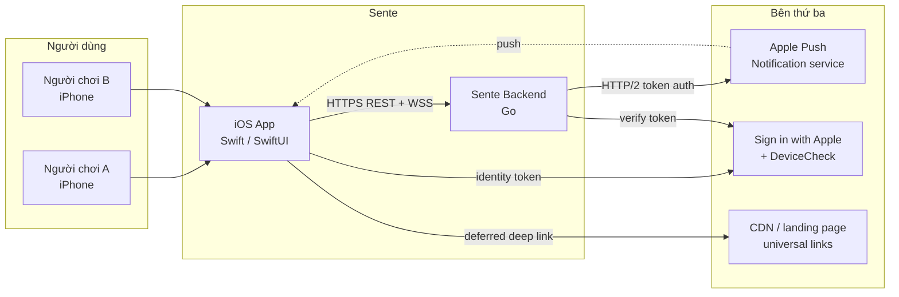
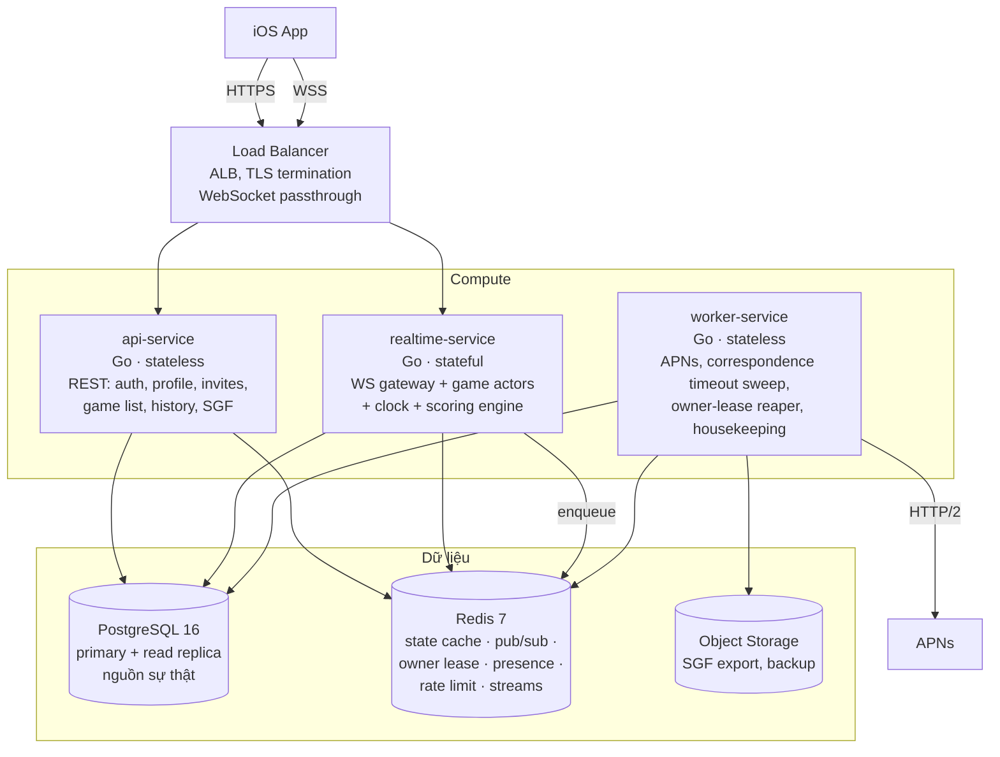
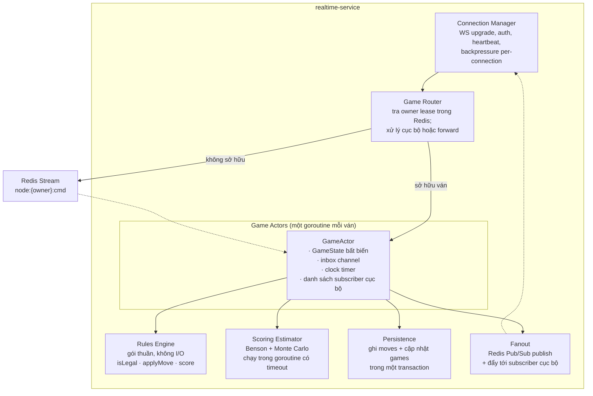
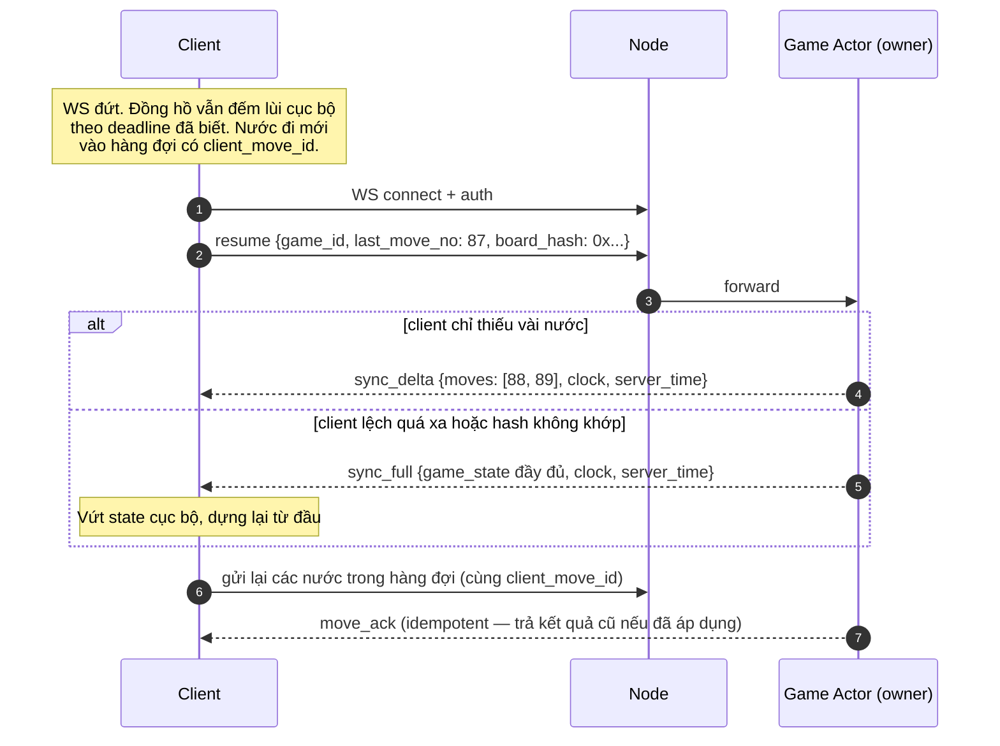
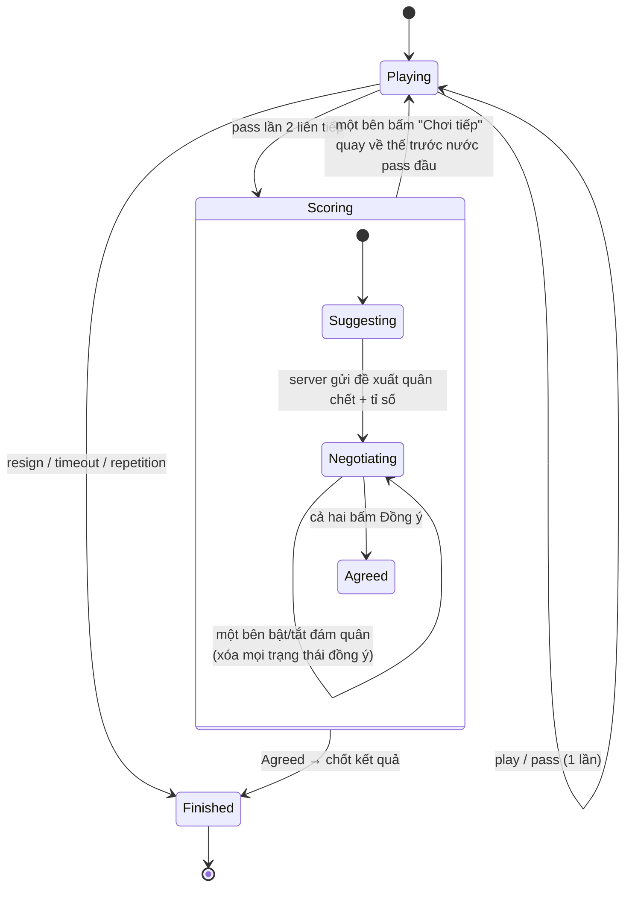
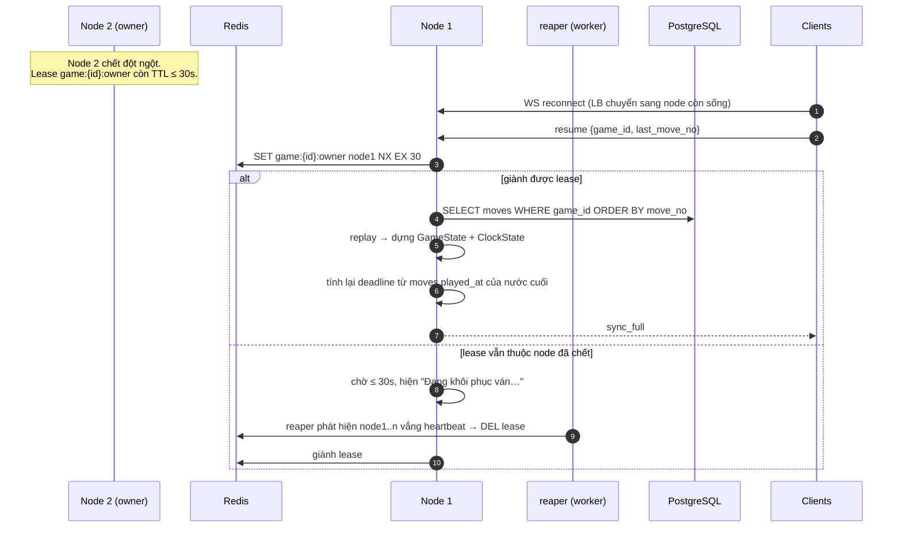
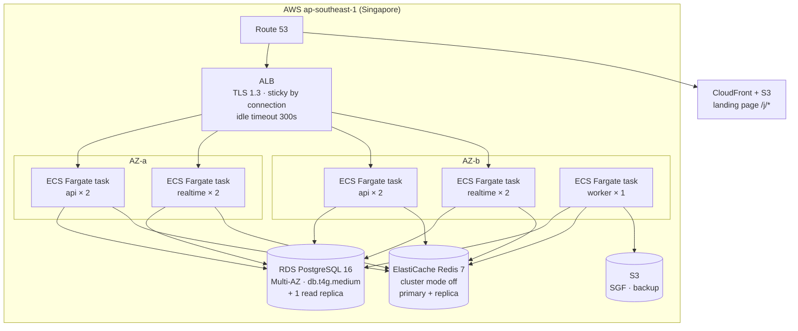

# 04 — Architecture

> Kiến trúc hệ thống. Lý do đằng sau mỗi lựa chọn nằm ở [03-solution-design.md](03-solution-design.md).

## 1. Bối cảnh hệ thống



## 2. Sơ đồ container



### Vì sao tách ba service

| Service | Trạng thái | Lý do tách | Scale theo |
|---------|-----------|------------|-----------|
| `api-service` | Stateless | Deploy/rollback độc lập, không làm đứt kết nối WS của ai | RPS |
| `realtime-service` | **Stateful** (giữ ván trong RAM) | Deploy phải drain kết nối cẩn thận; đây là service duy nhất cần vậy | Số ván live đồng thời |
| `worker-service` | Stateless | Công việc chậm/không đảm bảo (APNs) không được ở đường nóng | Độ sâu hàng đợi |

Ở giai đoạn MVP cả ba có thể chạy trong **một binary** với cờ bật/tắt từng vai trò, deploy
trên 2 máy nhỏ. Ranh giới module đã đúng nên tách ra sau chỉ là việc đổi cấu hình.

## 3. Thành phần bên trong `realtime-service`



**Nguyên tắc phân lớp.** `Rules Engine` là gói thuần: không mạng, không DB, không log, không
thời gian. Nó nhận `GameState` và trả `GameState`. Đây là điều kiện để test nó cạn kiệt bằng
conformance vectors ([ADR-002](03-solution-design.md#adr-002--nơi-đặt-engine-luật-cờ)) và
property-based test.

**GameActor** là nơi duy nhất kết hợp luật + thời gian + I/O. Nó có một inbox channel; mọi
lệnh (`move`, `pass`, `resign`, `mark_dead`, `accept`, `timeout`, `join`, `leave`) đi qua đó,
nên **không có lock nào cần thiết** cho trạng thái ván.

```go
// GameActor owns one game; all mutations go through its inbox, so the state
// needs no locking. The actor exits when the game ends or goes idle.
type GameActor struct {
    id      GameID
    state   *rules.GameState   // immutable; replaced, never mutated
    clock   *ClockState
    inbox   chan Command
    timer   *time.Timer        // fires at the current move deadline
    subs    map[ConnID]*Conn   // local subscribers on this node
}
```

**Vòng đời actor.** Sinh ra khi lệnh đầu tiên cho ván đó tới node đang giữ lease; tự kết thúc
sau 5 phút không có lệnh nào và không còn subscriber (giải phóng lease để node khác nhận).
Ván correspondence không bao giờ sinh actor — chúng đi đường REST ([§4.4](#44-ván-correspondence)).

## 4. Các luồng chính

### 4.1 Đi một nước (ván live, hai người ở hai node)

```mermaid
sequenceDiagram
    autonumber
    participant A as Client A
    participant N1 as Node 1 (gateway)
    participant RS as Redis Stream
    participant N2 as Node 2 (owner)
    participant PG as PostgreSQL
    participant PS as Redis Pub/Sub
    participant B as Client B

    A->>A: isLegal + applyMove cục bộ<br/>hiển thị quân "pending"
    A->>N1: move {client_move_id, expected_move_no, point}
    N1->>N1: tra owner lease → node 2
    N1->>RS: XADD game:{id}:cmd
    RS->>N2: consume
    N2->>N2: kiểm tra lượt · chargeClock · isLegal · applyMove
    alt hợp lệ
      N2->>PG: BEGIN; INSERT moves; UPDATE games; COMMIT
      N2->>PS: PUBLISH game:{id} move_made{...}
      PS-->>N1: move_made
      PS-->>N2: move_made
      N1-->>A: move_ack + move_made
      N2-->>B: move_made
      A->>A: bỏ trạng thái pending, haptic
    else bất hợp lệ
      N2-->>N1: move_rejected{reason, full_state?}
      N1-->>A: move_rejected
      A->>A: rollback về state trước + hiện lý do
    end
```

> **Sửa lại khi cài đặt: stream theo node, không theo ván.** Bản đầu dùng
> `game:{id}:cmd` — một stream mỗi ván. Node sở hữu khi đó phải `XREAD` trên hàng nghìn key
> cùng lúc, thứ Redis không làm gọn được. Với `node:{owner}:cmd`, mỗi node chỉ có **một**
> lần đọc blocking.
>
> Đánh đổi: nếu node chết trước khi kịp tiêu thụ, lệnh nằm lại trong stream của node đó thay
> vì được node tiếp quản nhìn thấy. Chấp nhận được vì client vốn đã gửi lại kèm
> `client_move_id`, và tính idempotent ở server khiến việc gửi lại luôn an toàn.
> Cài đặt: `internal/hub/hub.go`.

**Ghi chú.** `move_ack` là bắt buộc trước khi client coi nước đi là chắc chắn. Nếu ván nằm
trên chính node đang giữ kết nối (trường hợp phổ biến hơn), bước 3–5 biến mất và độ trễ chỉ
còn một RTT.

**Ràng buộc thứ tự.** Server ghi DB **trước** khi publish. Nếu ghi DB lỗi, nước đi không tồn
tại và client sẽ nhận `move_rejected{reason:"internal"}` — không bao giờ có tình huống client
thấy nước đi mà DB không có.

### 4.2 Kết nối lại và đồng bộ (`resume`)



`board_hash` là chốt an toàn: nếu client và server cùng ở `move_no = 87` nhưng hash khác nhau,
đã có bug ở đâu đó. Server ép `sync_full` và bắn metric `game_desync_total` ([ADR-015](03-solution-design.md#adr-015--quan-sát-hệ-thống-observability-từ-ngày-đầu)).

### 4.3 Kết thúc ván và đếm điểm



Trạng thái đàm phán quân chết sống trong `GameActor` và **không** ghi DB cho tới khi chốt —
nó là trạng thái tạm. Nếu node chết giữa chừng, ván khôi phục về đầu giai đoạn `Scoring` và
chạy lại đề xuất; hai bên chỉ mất vài thao tác chạm.

### 4.4 Ván correspondence

Không dùng actor, không dùng WebSocket bắt buộc, không giữ gì trong RAM:

```mermaid
sequenceDiagram
    autonumber
    participant C as Client
    participant API as api-service
    participant PG as PostgreSQL
    participant W as worker-service
    participant AP as APNs

    C->>API: POST /v1/games/{id}/moves {client_move_id, expected_move_no, point}
    API->>PG: SELECT ... FOR UPDATE (khóa dòng game)
    API->>API: replay moves → GameState → isLegal → applyMove
    API->>PG: INSERT moves; UPDATE games SET move_deadline = now() + interval; COMMIT
    API-->>C: 200 {move_no, deadline}
    API->>PG: NOTIFY / enqueue push job
    W->>AP: push "Đến lượt bạn"

    loop mỗi phút
      W->>PG: SELECT games WHERE move_deadline < now() AND phase='playing'
      W->>PG: kết thúc ván với reason='timeout'
      W->>AP: push kết quả cho cả hai
    end
```

Khóa dòng `SELECT ... FOR UPDATE` thay cho actor: ván correspondence có tần suất thấp nên chi
phí một transaction mỗi nước là chấp nhận được, đổi lại không tốn RAM cho hàng trăm nghìn ván
đang mở ([ADR-005](03-solution-design.md#adr-005--sở-hữu-ván-single-owner-actor--định-tuyến-qua-redis)).

**Nếu người chơi đang mở app**, họ vẫn có WS và nhận `move_made` qua Redis Pub/Sub như bình
thường — `api-service` publish sau khi commit.

### 4.5 Node sở hữu ván bị chết



**Điều quan trọng về đồng hồ.** Deadline được tính lại từ `moves.played_at` của nước cuối
cùng đã commit, **không** từ thời điểm khôi phục. Nghĩa là thời gian node chết vẫn bị trừ vào
đồng hồ của người đang tới lượt — đúng về mặt luật, nhưng bất công nếu sự cố kéo dài.
**Giảm nhẹ:** nếu khoảng gián đoạn > 15 giây, cộng bù đúng khoảng gián đoạn cho bên đang tới
lượt và gửi kèm `clock_adjusted{reason:"server_interruption", ms:N}` để client hiển thị minh bạch.

> **Sửa lại khi cài đặt: chỉ bù khi ván bị *bỏ rơi*, không bù khi ván *đỗ xe*.** Bản đầu bù
> cho mọi khoảng trống > 15 giây. Với ván thư tín, actor rỗi tự tắt sau 5 phút là chuyện
> bình thường, và khoảng trống hai ngày sau đó là thời gian người chơi suy nghĩ — bù nó nghĩa
> là **không ai bao giờ hết giờ**. Cách phân biệt: node dừng actor một cách chủ động (rỗi,
> drain, mất lease) ghi `games.parked_at`; node nhận ván xóa cột đó. Khi tiếp quản mà
> `parked_at IS NULL` → chủ cũ chết không kịp nói → bù giờ. Ván mới tạo cũng ở trạng thái đỗ
> xe: chưa ai chạy nó nên không có gì bị gián đoạn. Cài đặt: `internal/node/registry.go`,
> test `TestAParkedGameGetsNoCompensation`.
>
> Hệ quả kéo theo: ván hết hạn khi không node nào chạy nó cần một **sweeper** đọc
> `games.move_deadline < now()` mỗi phút và đẩy `TimeoutCommand` qua hub
> (`internal/sweep`). Actor vừa khởi động cho ván quá hạn sẽ tự bắn timer ngay lập tức, nên
> sweeper đếm kết quả bằng cách đọc lại DB thay vì tin vào lệnh của mình.

## 5. Triển khai

### 5.1 Hạ tầng (giai đoạn v1.0)



**Lưu ý cấu hình quan trọng.**
- ALB idle timeout phải **> chu kỳ heartbeat** của WS (heartbeat 20s ⇒ idle timeout 300s an toàn).
- ALB không hỗ trợ sticky session theo `game_id` — điều này đã được tính đến trong ADR-005;
  định tuyến ván do tầng ứng dụng làm, không nhờ LB.
- Bật **deletion protection** cho RDS và **automated backup** giữ 14 ngày (đáp ứng
  [NFR-S5](01-requirements.md#52-khả-năng-chịu-tải--sẵn-sàng)).

### 5.2 Deploy `realtime-service` không làm đứt ván

Đây là service stateful, nên rolling deploy mặc định sẽ ngắt ván giữa chừng. Quy trình drain:

```
1. Task nhận SIGTERM
2. Ngừng nhận kết nối mới (health check trả unhealthy → ALB rút khỏi target group)
3. Với mỗi ván đang sở hữu:
     a. Ghi checkpoint xuống DB (đảm bảo mọi nước đi đã commit)
     b. Nhả lease Redis
     c. Gửi close frame code 4001 "server_restarting" cho subscriber cục bộ
4. Client nhận 4001 → reconnect NGAY LẬP TỨC (không backoff — server chủ động báo)
5. Ván được node khác nhận qua đường resume (§4.2)
6. Task thoát sau tối đa 30s
```

Gián đoạn thực tế: 200–800ms cho mỗi ván. Kết hợp với bù giờ ở [§4.5](#45-node-sở-hữu-ván-bị-chết),
người chơi thấy banner "Đang kết nối lại…" chớp qua.

**Deploy vào giờ thấp điểm** (3–5h sáng giờ VN) cho các thay đổi lớn.

### 5.3 Môi trường

| Môi trường | Mục đích | Dữ liệu | Ghi chú |
|-----------|----------|---------|---------|
| `local` | Dev | Docker Compose: PG + Redis | Toàn bộ backend chạy trong một binary |
| `dev` | Tích hợp liên tục | Sinh tự động | Reset mỗi đêm |
| `staging` | Kiểm thử trước phát hành | Ẩn danh hóa từ prod | Cấu hình giống prod, quy mô nhỏ hơn; TestFlight trỏ vào đây |
| `prod` | Thật | — | Deploy có phê duyệt |

## 6. Mô hình dung lượng

Ước lượng cho mục tiêu [NFR-S1/S2](01-requirements.md#52-khả-năng-chịu-tải--sẵn-sàng):
10.000 ván live đồng thời.

| Nguồn lực | Tính toán | Kết quả |
|-----------|-----------|---------|
| Kết nối WS | 10.000 ván × 2 người + 20% spectator/đa thiết bị | ~24.000 kết nối |
| RAM cho actor | 10.000 ván × (GameState 19×19 ≈ 500B + history hash 300 × 8B + overhead) ≈ 6KB | ~60 MB |
| RAM cho kết nối | 24.000 × (goroutine 8KB + buffer 16KB) | ~580 MB |
| **RAM realtime tổng** | + runtime + slack | **~1.5 GB** → 4 task × 1GB đủ dư |
| Nước đi/giây | 10.000 ván × 1 nước / 20 giây trung bình | ~500 move/s |
| CPU cho luật | 500/s × 30µs | ~0.015 core — không đáng kể |
| Ghi DB | 500 INSERT/s + 500 UPDATE/s | Trong khả năng của `db.t4g.medium`; dùng batch commit nếu cần |
| CPU cho scoring | ~10 ván kết thúc/s × 60ms | ~0.6 core → tách pool goroutine giới hạn 2 core |
| Băng thông | 500 move/s × 2 người × 150B | ~150 KB/s — không đáng kể |

**Nút thắt thật sự** không phải CPU luật mà là **ghi PostgreSQL** và **RAM cho kết nối**.
Hướng mở rộng khi vượt: (a) batch commit nước đi trong cửa sổ 20ms, (b) tách bảng `moves`
theo tháng (partition), (c) thêm task realtime — kiến trúc đã scale ngang sẵn.

## 7. Chế độ hỏng và cách xử lý

| Chế độ hỏng | Phát hiện | Xử lý | Trải nghiệm người dùng |
|-------------|-----------|-------|------------------------|
| Client mất mạng | Heartbeat timeout | Client tự reconnect với backoff 1s → 30s + jitter | Banner "Đang kết nối lại…", vẫn đi được nước (vào hàng đợi) |
| Node realtime chết | Lease hết hạn / reaper | Node khác nhận lease, replay từ DB ([§4.5](#45-node-sở-hữu-ván-bị-chết)) | Gián đoạn < 10s, có bù giờ |
| Redis không truy cập được | Health check | **Degrade:** ván trên cùng node vẫn chơi được (actor ở RAM); ván xuyên node và tạo ván mới bị chặn | Banner "Dịch vụ đang gặp sự cố"; ván đang chơi tiếp tục |
| PostgreSQL primary chết | RDS failover | Failover Multi-AZ 60–120s; actor **tạm dừng ghi** và buffer nước đi trong RAM tối đa 60s, sau đó từ chối | Nước đi chậm hoặc bị từ chối trong ~1 phút |
| APNs lỗi | Mã lỗi từ APNs | Retry với backoff trong worker; không ảnh hưởng ván | Push tới muộn |
| Bug engine luật | `illegal_move_rejected_total` tăng | Cảnh báo ngay; hotfix client hoặc bật cờ "server-authoritative validation" | Có thể thấy quân bị giật ngược |
| Ván "kẹt" (bug) | Job kiểm tra tính nhất quán mỗi giờ | Đánh dấu ván cần can thiệp; công cụ admin để hủy/khôi phục | Ván hiện trạng thái "đang xử lý" |

**Nguyên tắc chung khi hỏng:** thà **từ chối một nước đi** với lý do rõ ràng còn hơn ghi nhận
một nước đi mà không chắc đã lưu. Ván cờ mất một nước đi là hỏng vĩnh viễn; người chơi thử
lại một nước là phiền một chút.

## 8. Bảo mật ở tầng kiến trúc

Chi tiết ở [08-security-fairplay.md](08-security-fairplay.md). Ở tầng kiến trúc:

- Chỉ ALB có địa chỉ công khai. Compute nằm trong private subnet, ra ngoài qua NAT.
- RDS và Redis chỉ nhận kết nối từ security group của compute.
- Bí mật (JWT signing key, APNs `.p8`, DB password) trong AWS Secrets Manager, nạp lúc khởi
  động, không bao giờ vào biến môi trường hiển thị trong log hay image.
- Rate limit ở hai tầng: WAF ở ALB (theo IP) và token bucket trong Redis (theo `user_id`).
- Mọi log bỏ qua nội dung chat và token; chỉ log `trace_id`, `user_id`, `game_id`.

## 9. Quan sát và vận hành

### 9.1 Dashboard bắt buộc

| Bảng | Nội dung |
|------|----------|
| **Sức khỏe ván** | Số ván live, số kết nối WS, `move_apply_duration` p50/p95/p99, tỉ lệ `move_rejected` theo lý do |
| **Cảnh báo lệch engine** | `illegal_move_rejected_total{reason ∈ luật}`, `game_desync_total` — **cả hai phải bằng 0** |
| **Vòng đời ván** | `game_ended_total{reason}`, thời lượng ván trung vị, tỉ lệ abandonment |
| **Hạ tầng** | CPU/RAM theo task, kết nối DB, độ trễ Redis, độ sâu hàng đợi push |

### 9.2 Cảnh báo (alert)

| Cảnh báo | Ngưỡng | Mức |
|----------|--------|-----|
| `illegal_move_rejected_total{reason="suicide"\|"ko"\|"superko"}` | > 0 trong 5 phút | **P1** — có người chơi thật đang gặp lỗi |
| `game_desync_total` | > 10 trong 5 phút | P1 |
| `move_apply_duration` p95 | > 100ms trong 10 phút | P2 |
| Lease reclaim | > 5 lần/phút | P2 — node đang chập chờn |
| Ván kẹt ở `scoring` > 1 giờ | bất kỳ | P3 |
| Tỉ lệ abandonment | > 15% ngày | P3 — vấn đề sản phẩm, không phải kỹ thuật |

### 9.3 Runbook cần viết trước khi lên prod

1. Node realtime kẹt / không nhả lease.
2. Ván bị kẹt ở `scoring` hoặc `playing` không tiến triển.
3. Phát hiện lệch engine giữa client và server.
4. RDS failover.
5. Khôi phục dữ liệu từ backup (đã diễn tập ít nhất một lần).

## 10. Bản đồ mã nguồn

### Backend (`sente-server`)

```
cmd/
  server/main.go              # một binary, bật vai trò bằng cờ: -api -realtime -worker
internal/
  rules/                      # GÓI THUẦN — không I/O, không time, không log
    board.go                  # biểu diễn bàn, flood fill, khí
    move.go                   # isLegal, applyMove, simulate
    ko.go                     # ko cơ bản + superko
    score.go                  # đếm điểm Nhật / Trung
    benson.go                 # sống vô điều kiện
    estimate.go               # Monte Carlo ownership
    zobrist.go                # nạp bảng hằng số dùng chung
    sgf/                      # đọc/ghi SGF
  game/
    actor.go                  # GameActor: inbox, timer, vòng đời
    clock.go                  # các thể thức thời gian
    router.go                 # tra lease, forward hoặc xử lý cục bộ
    repository.go             # đọc/ghi PostgreSQL
  realtime/
    conn.go                   # WS upgrade, heartbeat, backpressure
    protocol.go               # định nghĩa message (khớp với doc 06)
    fanout.go                 # Redis Pub/Sub
  api/                        # handler REST
  auth/                       # JWT, Sign in with Apple, DeviceCheck
  push/                       # APNs client
  worker/                     # sweeper, reaper, push worker
  platform/                   # db, redis, config, otel, logging
rules-spec/                   # submodule: vectors + zobrist_table.json
```

### iOS (`sente-ios`) — chi tiết ở [07](07-ios-app-design.md)

```
Sente.xcodeproj
Packages/
  GoKit/          # engine luật Swift thuần — mirror của internal/rules
  SenteNet/       # REST client + WS client + reconnect
  SenteUI/        # BoardView, thành phần dùng chung, design tokens
App/
  Features/       # Home, Invite, Game, Scoring, History, Replay, Settings
  Core/           # DI, persistence (SwiftData), push, deep link
```

`GoKit` và `internal/rules` là hai bản của cùng một đặc tả ([02](02-go-rules-spec.md)) và
cùng chạy `rules-spec/vectors` trong CI — đây là ràng buộc kiến trúc quan trọng nhất của
toàn hệ thống ([ADR-002](03-solution-design.md#adr-002--nơi-đặt-engine-luật-cờ)).
