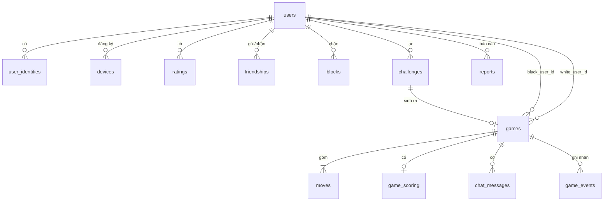

# 05 — Data Model

> PostgreSQL 16 là nguồn sự thật; Redis là cache và hạ tầng điều phối, **luôn có thể mất
> sạch mà không ảnh hưởng tính đúng đắn**. Lý do của mô hình append-only ở
> [ADR-006](03-solution-design.md#adr-006--lưu-trữ-append-only-moves-thế-cờ-là-dữ-liệu-dẫn-xuất).

## 1. Sơ đồ quan hệ



## 2. Quy ước chung

| Quy ước | Giá trị |
|---------|---------|
| Khóa chính | `UUID v7` (sắp xếp theo thời gian → thân thiện với B-tree index) |
| Thời gian | `TIMESTAMPTZ`, luôn lưu UTC |
| Tiền/điểm số | `NUMERIC`, không dùng `FLOAT` (komi 6.5 phải chính xác) |
| Enum | `TEXT` + `CHECK` constraint, **không** dùng `ENUM` của Postgres (khó migrate) |
| Cấu trúc thay đổi thường xuyên | `JSONB` (time control, result) — có `CHECK` xác thực shape |
| Xóa | Soft delete (`deleted_at`) cho `users`; hard delete cho dữ liệu phái sinh |
| Tọa độ giao điểm | `SMALLINT` = `row * board_size + col`, 0-based (0..360 cho 19×19) |

**Vì sao mã hóa tọa độ thành một số nguyên:** một ván 19×19 có ~300 nước; lưu hai cột
`col`,`row` tốn thêm dung lượng và index mà không cho query hữu ích nào. Chuyển đổi là hai
phép chia.

## 3. Người dùng và danh tính

```sql
CREATE TABLE users (
    id              UUID PRIMARY KEY,
    display_name    TEXT        NOT NULL,
    friend_code     TEXT        NOT NULL UNIQUE,   -- 8 ký tự, bộ chữ không nhập nhằng
    is_guest        BOOLEAN     NOT NULL DEFAULT TRUE,
    locale          TEXT        NOT NULL DEFAULT 'vi',
    settings        JSONB       NOT NULL DEFAULT '{}'::jsonb,
    banned_until    TIMESTAMPTZ,
    created_at      TIMESTAMPTZ NOT NULL DEFAULT now(),
    updated_at      TIMESTAMPTZ NOT NULL DEFAULT now(),
    deleted_at      TIMESTAMPTZ,

    CONSTRAINT display_name_len CHECK (char_length(display_name) BETWEEN 2 AND 24),
    CONSTRAINT friend_code_fmt  CHECK (friend_code ~ '^[ABCDEFGHJKLMNPQRSTUVWXYZ23456789]{8}$')
);

CREATE INDEX idx_users_active ON users (id) WHERE deleted_at IS NULL;
```

`friend_code` bỏ các ký tự dễ nhầm (`I`, `O`, `0`, `1`) để người dùng đọc qua điện thoại được.

```sql
-- Một user có thể có nhiều cách đăng nhập: thiết bị khách, Apple, (sau này) email.
-- Sửa lại khi cài đặt (2026-08-29): games có thêm undos_used SMALLINT (migration 0008);
-- một undo được chấp nhận XÓA hàng của nước đó khỏi moves (Games.Rewind) — ngoại lệ
-- duy nhất của quy tắc chỉ-ghi-thêm, vì replay phải khớp checksum của hàng games.

CREATE TABLE user_identities (
    id              UUID PRIMARY KEY,
    user_id         UUID        NOT NULL REFERENCES users(id) ON DELETE CASCADE,
    provider        TEXT        NOT NULL CHECK (provider IN ('device', 'apple', 'email')),
    subject         TEXT        NOT NULL,          -- device public key fingerprint | Apple sub | email
    metadata        JSONB       NOT NULL DEFAULT '{}'::jsonb,
    created_at      TIMESTAMPTZ NOT NULL DEFAULT now(),
    last_used_at    TIMESTAMPTZ,

    UNIQUE (provider, subject)
);

CREATE INDEX idx_identities_user ON user_identities (user_id);
```

```sql
CREATE TABLE refresh_tokens (
    id              UUID PRIMARY KEY,
    user_id         UUID        NOT NULL REFERENCES users(id) ON DELETE CASCADE,
    token_hash      BYTEA       NOT NULL UNIQUE,   -- SHA-256; token gốc không bao giờ lưu
    family_id       UUID        NOT NULL,          -- rotation family: dùng lại token cũ ⇒ thu hồi cả họ
    parent_id       UUID        REFERENCES refresh_tokens(id) ON DELETE SET NULL,
    expires_at      TIMESTAMPTZ NOT NULL,
    revoked_at      TIMESTAMPTZ,
    created_at      TIMESTAMPTZ NOT NULL DEFAULT now()
);

CREATE INDEX idx_refresh_family ON refresh_tokens (family_id) WHERE revoked_at IS NULL;
CREATE INDEX idx_refresh_expiry ON refresh_tokens (expires_at) WHERE revoked_at IS NULL;
```

```sql
CREATE TABLE devices (
    id              UUID PRIMARY KEY,
    user_id         UUID        NOT NULL REFERENCES users(id) ON DELETE CASCADE,
    apns_token      TEXT        NOT NULL,
    bundle_env      TEXT        NOT NULL CHECK (bundle_env IN ('sandbox', 'production')),
    app_version     TEXT,
    os_version      TEXT,
    locale          TEXT,
    push_prefs      JSONB       NOT NULL DEFAULT '{"turn":true,"low_time":true,"game_end":true,"invite":true}'::jsonb,
    last_seen_at    TIMESTAMPTZ NOT NULL DEFAULT now(),
    created_at      TIMESTAMPTZ NOT NULL DEFAULT now(),

    UNIQUE (apns_token, bundle_env)
);

CREATE INDEX idx_devices_user ON devices (user_id);
```

## 4. Quan hệ xã hội

```sql
CREATE TABLE friendships (
    requester_id    UUID        NOT NULL REFERENCES users(id) ON DELETE CASCADE,
    addressee_id    UUID        NOT NULL REFERENCES users(id) ON DELETE CASCADE,
    status          TEXT        NOT NULL CHECK (status IN ('pending', 'accepted', 'declined')),
    created_at      TIMESTAMPTZ NOT NULL DEFAULT now(),
    responded_at    TIMESTAMPTZ,

    PRIMARY KEY (requester_id, addressee_id),
    CONSTRAINT no_self_friend CHECK (requester_id <> addressee_id)
);

-- Truy vấn "bạn bè của tôi" phải quét cả hai chiều; index phía addressee cho chiều còn lại.
CREATE INDEX idx_friendships_addressee ON friendships (addressee_id, status);
```

```sql
CREATE TABLE blocks (
    blocker_id      UUID        NOT NULL REFERENCES users(id) ON DELETE CASCADE,
    blocked_id      UUID        NOT NULL REFERENCES users(id) ON DELETE CASCADE,
    created_at      TIMESTAMPTZ NOT NULL DEFAULT now(),
    PRIMARY KEY (blocker_id, blocked_id)
);
```

Chặn có hiệu lực: không nhận lời mời, không ghép ngẫu nhiên, không thấy chat. **Không** hủy
ván đang chơi dở (tránh lạm dụng để thoát ván khi đang thua) — thay vào đó chat bị ẩn.

## 5. Lời mời

```sql
CREATE TABLE challenges (
    id              UUID PRIMARY KEY,
    code            TEXT        NOT NULL UNIQUE,   -- 8 ký tự, cùng bộ chữ với friend_code
    creator_id      UUID        NOT NULL REFERENCES users(id) ON DELETE CASCADE,
    invitee_id      UUID        REFERENCES users(id) ON DELETE CASCADE,  -- NULL = link mở
    config          JSONB       NOT NULL,          -- xem §5.1
    creator_color   TEXT        NOT NULL CHECK (creator_color IN ('black', 'white', 'random')),
    status          TEXT        NOT NULL CHECK (status IN ('pending','accepted','declined','expired','cancelled')),
    game_id         UUID        REFERENCES games(id) ON DELETE SET NULL,
    expires_at      TIMESTAMPTZ NOT NULL,
    created_at      TIMESTAMPTZ NOT NULL DEFAULT now(),
    resolved_at     TIMESTAMPTZ
);

CREATE INDEX idx_challenges_creator ON challenges (creator_id, status);
CREATE INDEX idx_challenges_invitee ON challenges (invitee_id, status) WHERE invitee_id IS NOT NULL;
CREATE INDEX idx_challenges_expiry  ON challenges (expires_at) WHERE status = 'pending';
```

### 5.1 Shape của `challenges.config` và `games.time_control`

```json
{
  "board_size": 19,
  "rules": "japanese",
  "komi": 6.5,
  "handicap": 0,
  "is_ranked": false,
  "time_control": {
    "kind": "byoyomi",
    "main_time_ms": 1200000,
    "periods": 3,
    "period_time_ms": 30000
  }
}
```

Các biến thể của `time_control`:

```json
{ "kind": "absolute",       "main_time_ms": 1800000 }
{ "kind": "fischer",        "main_time_ms": 600000, "increment_ms": 10000, "max_time_ms": 900000 }
{ "kind": "byoyomi",        "main_time_ms": 1200000, "periods": 3, "period_time_ms": 30000 }
{ "kind": "correspondence", "days_per_move": 2 }
```

Vì `correspondence` lưu theo **ngày nguyên**, thời gian mỗi nước phải là bội số của 24 giờ —
encoder từ chối giá trị lẻ thay vì làm tròn ngầm. `vacation_days` chưa cài (tính năng P2).

Ràng buộc shape được kiểm ở tầng ứng dụng (Go struct + validate) **và** ở DB bằng
`CHECK (config ? 'board_size' AND config ? 'time_control')` như một lưới an toàn tối thiểu.
Không cố mô tả toàn bộ shape bằng `CHECK` — đó là việc của tầng ứng dụng.

## 6. Ván cờ

```sql
CREATE TABLE games (
    id                  UUID PRIMARY KEY,
    board_size          SMALLINT    NOT NULL CHECK (board_size IN (9, 13, 19)),
    rules               TEXT        NOT NULL CHECK (rules IN ('japanese', 'chinese')),
    rules_version       TEXT        NOT NULL,       -- phiên bản engine lúc ván diễn ra (ADR-006)
    komi                NUMERIC(4,1) NOT NULL,
    handicap            SMALLINT    NOT NULL DEFAULT 0
                                    CHECK (handicap = 0 OR handicap BETWEEN 2 AND 9),
    time_control        JSONB       NOT NULL,
    is_ranked           BOOLEAN     NOT NULL DEFAULT FALSE,
    is_correspondence   BOOLEAN     NOT NULL,

    black_user_id       UUID        REFERENCES users(id) ON DELETE SET NULL,
    white_user_id       UUID        REFERENCES users(id) ON DELETE SET NULL,

    phase               TEXT        NOT NULL
                                    CHECK (phase IN ('pending','playing','scoring','finished','aborted')),
    to_play             TEXT        CHECK (to_play IN ('black', 'white')),
    current_move_no     INT         NOT NULL DEFAULT 0,
    consecutive_passes  SMALLINT    NOT NULL DEFAULT 0,
    ko_point            SMALLINT,                   -- mã hóa row*size+col, NULL nếu không có
    board_hash          BIGINT      NOT NULL,       -- Zobrist; checksum khi replay (ADR-006)
    captures_black      SMALLINT    NOT NULL DEFAULT 0,
    captures_white      SMALLINT    NOT NULL DEFAULT 0,

    clock               JSONB       NOT NULL,       -- xem §6.1
    move_deadline       TIMESTAMPTZ,                -- NULL khi không ở phase 'playing'

    result              JSONB,                      -- xem §6.2, NULL cho tới khi kết thúc

    created_at          TIMESTAMPTZ NOT NULL DEFAULT now(),
    started_at          TIMESTAMPTZ,
    ended_at            TIMESTAMPTZ,
    last_activity_at    TIMESTAMPTZ NOT NULL DEFAULT now(),

    CONSTRAINT finished_has_result CHECK (phase <> 'finished' OR result IS NOT NULL),
    CONSTRAINT playing_has_deadline CHECK (phase <> 'playing' OR move_deadline IS NOT NULL)
);

-- "Ván của tôi", sắp xếp theo hoạt động gần nhất — truy vấn nóng nhất của app.
CREATE INDEX idx_games_black_active ON games (black_user_id, last_activity_at DESC)
    WHERE phase IN ('playing', 'scoring');
CREATE INDEX idx_games_white_active ON games (white_user_id, last_activity_at DESC)
    WHERE phase IN ('playing', 'scoring');

-- Job quét hết giờ cho ván correspondence.
CREATE INDEX idx_games_deadline ON games (move_deadline)
    WHERE phase = 'playing' AND is_correspondence;

-- Job dọn ván bỏ dở.
CREATE INDEX idx_games_stale ON games (last_activity_at)
    WHERE phase IN ('playing', 'scoring');

-- Lịch sử: phân trang theo thời gian kết thúc.
CREATE INDEX idx_games_history_black ON games (black_user_id, ended_at DESC) WHERE phase = 'finished';
CREATE INDEX idx_games_history_white ON games (white_user_id, ended_at DESC) WHERE phase = 'finished';
```

### 6.1 Shape của `games.clock`

```json
{
  "control": { "kind": "byoyomi", "main_time_ms": 1200000, "periods": 3, "period_time_ms": 30000 },
  "black": { "main_ms": 845000, "periods_left": 3, "period_ms": 30000, "lag_grace_used_ms": 1200 },
  "white": { "main_ms": 1102000, "periods_left": 3, "period_ms": 30000, "lag_grace_used_ms": 800 },
  "turn_started_at": "2026-08-28T09:14:03.221Z"
}
```

> **Sửa lại khi cài đặt.** Bản đầu tách `lag_grace_used_ms` ra một object riêng ở cấp ngoài,
> khiến trạng thái của một người chơi nằm rải ở hai chỗ — mọi lần đọc/ghi đều phải ghép lại.
> Giờ mỗi bên là một object khép kín. Cũng đổi `periods` → `periods_left` cho khỏi nhầm với
> `control.periods` (tổng số kỳ ban đầu), và nhúng luôn `control` để dựng lại đồng hồ chỉ cần
> đọc một cột. Cài đặt: `internal/game/json.go`.

### 6.2 Shape của `games.result`

```json
{
  "winner": "white",
  "reason": "counting",
  "score": {
    "black": 42.0,
    "white": 45.5,
    "detail": {
      "black": { "territory": 38, "captures": 4, "komi": 0 },
      "white": { "territory": 33, "captures": 6, "komi": 6.5 }
    }
  },
  "rating_change": { "black": -8, "white": 8 }
}
```

`reason` ∈ `counting` | `resignation` | `timeout` | `repetition` | `abandonment` | `mutual_draw`.
Khi `reason` là `repetition` thì `winner` là `null` (ván vô hiệu, xem
[02 §4.3](02-go-rules-spec.md#43-lặp-thế-trong-hệ-luật-nhật-triple-ko)).

## 7. Nước đi — bảng quan trọng nhất

```sql
CREATE TABLE moves (
    game_id         UUID        NOT NULL REFERENCES games(id) ON DELETE CASCADE,
    move_no         INT         NOT NULL,           -- bắt đầu từ 1
    color           TEXT        NOT NULL CHECK (color IN ('black', 'white')),
    kind            TEXT        NOT NULL CHECK (kind IN ('play', 'pass', 'resign')),
    point           SMALLINT,                       -- NULL với pass/resign
    captured_count  SMALLINT    NOT NULL DEFAULT 0,
    board_hash      BIGINT      NOT NULL,           -- hash SAU nước đi này
    client_move_id  UUID,                           -- idempotency key do client sinh (ADR-007)
    played_at       TIMESTAMPTZ NOT NULL,
    time_left_ms    INT,                            -- đồng hồ bên đi SAU khi trừ
    periods_left    SMALLINT,

    PRIMARY KEY (game_id, move_no),
    CONSTRAINT play_has_point CHECK ((kind = 'play') = (point IS NOT NULL))
);

-- Chống ghi trùng khi client gửi lại sau reconnect. Đây là thứ khiến J3 hoạt động.
CREATE UNIQUE INDEX idx_moves_idempotency ON moves (game_id, client_move_id)
    WHERE client_move_id IS NOT NULL;
```

**Không có cột `id` riêng.** `(game_id, move_no)` là khóa tự nhiên, và mọi truy vấn đều theo
ván. Điều này còn cho phép clustered access: các nước của cùng một ván nằm cạnh nhau trên đĩa.

**Ghi chú về `board_hash` trên từng nước.** Tốn 8 byte/nước nhưng cho phép:
- Xác minh replay đúng ở bất kỳ điểm nào, không chỉ ở cuối ván.
- Client gửi `board_hash` khi resume để phát hiện desync ([04 §4.2](04-architecture.md#42-kết-nối-lại-và-đồng-bộ-resume)).
- Dò lỗi engine trong quá khứ: replay lại toàn bộ ván bằng engine mới, tìm nước đầu tiên lệch hash.

**Phân vùng (khi cần).** Ở 1 triệu ván × 200 nước = 200 triệu dòng, cân nhắc
`PARTITION BY RANGE (game_id)` theo tiền tố UUID v7 (tức là theo thời gian). Chưa cần ở v1.0;
ghi lại để không thiết kế chặn đường.

## 8. Giai đoạn đếm điểm

```sql
CREATE TABLE game_scoring (
    game_id             UUID        PRIMARY KEY REFERENCES games(id) ON DELETE CASCADE,
    dead_points         SMALLINT[]  NOT NULL DEFAULT '{}',   -- các giao điểm đánh dấu chết
    suggested_points    SMALLINT[]  NOT NULL DEFAULT '{}',   -- đề xuất ban đầu của server
    black_accepted      BOOLEAN     NOT NULL DEFAULT FALSE,
    white_accepted      BOOLEAN     NOT NULL DEFAULT FALSE,
    computed_score      JSONB,
    resume_from_move_no INT         NOT NULL,                -- để quay lại chơi tiếp
    updated_at          TIMESTAMPTZ NOT NULL DEFAULT now()
);
```

Chỉ ghi khi vào `phase = 'scoring'`. Trong lúc đàm phán, trạng thái sống trong `GameActor`;
ghi DB khi chốt hoặc mỗi 10 giây (checkpoint), đủ để khôi phục sau sự cố mà không tốn ghi.

## 9. Chat và sự kiện

```sql
CREATE TABLE chat_messages (
    id              UUID PRIMARY KEY,
    game_id         UUID        NOT NULL REFERENCES games(id) ON DELETE CASCADE,
    user_id         UUID        REFERENCES users(id) ON DELETE SET NULL,
    body            TEXT        NOT NULL CHECK (char_length(body) BETWEEN 1 AND 500),
    move_no         INT         NOT NULL,           -- neo vào nước đi để replay hiển thị đúng chỗ
    is_hidden       BOOLEAN     NOT NULL DEFAULT FALSE,   -- ẩn bởi moderation
    created_at      TIMESTAMPTZ NOT NULL DEFAULT now()
);

CREATE INDEX idx_chat_game ON chat_messages (game_id, created_at);
```

```sql
-- Nhật ký kiểm toán các sự kiện không phải nước đi. Chỉ ghi thêm.
CREATE TABLE game_events (
    id              BIGSERIAL PRIMARY KEY,
    game_id         UUID        NOT NULL REFERENCES games(id) ON DELETE CASCADE,
    move_no         INT         NOT NULL,
    actor_user_id   UUID        REFERENCES users(id) ON DELETE SET NULL,
    kind            TEXT        NOT NULL,
    payload         JSONB       NOT NULL DEFAULT '{}'::jsonb,
    created_at      TIMESTAMPTZ NOT NULL DEFAULT now()
);

CREATE INDEX idx_game_events_game ON game_events (game_id, id);
```

`kind` ∈ `undo_requested` | `undo_accepted` | `undo_declined` | `dead_marks_changed` |
`scoring_accepted` | `scoring_resumed` | `clock_adjusted` | `owner_reclaimed` |
`player_disconnected` | `player_reconnected` | `admin_intervention`.

Bảng này là thứ trả lời được câu hỏi *"vì sao ván này ra kết quả kỳ lạ?"* khi có khiếu nại.

## 10. Xếp hạng (P2)

```sql
CREATE TABLE ratings (
    user_id         UUID        NOT NULL REFERENCES users(id) ON DELETE CASCADE,
    board_size      SMALLINT    NOT NULL,
    speed           TEXT        NOT NULL CHECK (speed IN ('blitz', 'live', 'correspondence')),
    rating          NUMERIC(7,2) NOT NULL DEFAULT 1500,
    deviation       NUMERIC(7,2) NOT NULL DEFAULT 350,     -- Glicko-2 RD
    volatility      NUMERIC(7,5) NOT NULL DEFAULT 0.06,
    games_played    INT         NOT NULL DEFAULT 0,
    updated_at      TIMESTAMPTZ NOT NULL DEFAULT now(),

    PRIMARY KEY (user_id, board_size, speed)
);
```

Quy đổi hiển thị (xấp xỉ thang OGS): `rating < 2100` → kyu, `>= 2100` → dan. Công thức và
bảng quy đổi nằm trong mã nguồn, không hard-code trong DB.

Lịch sử biến động rating lấy từ `games.result->'rating_change'` — không cần bảng riêng.

## 11. Kiểm duyệt

```sql
CREATE TABLE reports (
    id              UUID PRIMARY KEY,
    reporter_id     UUID        NOT NULL REFERENCES users(id) ON DELETE CASCADE,
    reported_id     UUID        NOT NULL REFERENCES users(id) ON DELETE CASCADE,
    game_id         UUID        REFERENCES games(id) ON DELETE SET NULL,
    category        TEXT        NOT NULL CHECK (category IN ('abuse','cheating','escaping','name','other')),
    note            TEXT        CHECK (char_length(note) <= 1000),
    status          TEXT        NOT NULL DEFAULT 'open'
                                CHECK (status IN ('open','reviewing','actioned','dismissed')),
    resolution      TEXT,
    created_at      TIMESTAMPTZ NOT NULL DEFAULT now(),
    resolved_at     TIMESTAMPTZ,

    CONSTRAINT no_self_report CHECK (reporter_id <> reported_id)
);

CREATE INDEX idx_reports_open ON reports (created_at) WHERE status IN ('open', 'reviewing');
CREATE INDEX idx_reports_target ON reports (reported_id, created_at DESC);
```

## 12. Redis

Redis **không** giữ dữ liệu duy nhất. Mọi key đều có TTL và có thể tái tạo.

| Key | Kiểu | TTL | Mục đích |
|-----|------|-----|----------|
| `game:{id}:owner` | String = `node_id` | 30s, gia hạn 10s/lần | Lease sở hữu ván ([ADR-005](03-solution-design.md#adr-005--sở-hữu-ván-single-owner-actor--định-tuyến-qua-redis)) |
| `node:{id}:cmd` | Stream | `MAXLEN ~ 10000` | Hàng đợi lệnh gửi tới node sở hữu (xem [04 §4.1](04-architecture.md#41-đi-một-nước-ván-live-hai-người-ở-hai-node)) |
| `reply:{node}:{n}` | List | 30s | Trả lời cho một lệnh đã chuyển tiếp |
| `game:{id}:state` | String (msgpack) | 1h | Cache `GameState` đã dựng, tránh replay |
| `game:{id}` | Pub/Sub channel | — | Fanout `move_made`, `clock_update`, `chat`, … |
| `presence:user:{id}` | Set các `conn_id` | 60s | Trạng thái online, hiển thị cho bạn bè |
| `node:{id}:hb` | String | 15s | Heartbeat node; reaper dùng để phát hiện node chết |
| `rl:{user_id}:{bucket}` | String (counter) | theo cửa sổ | Token bucket rate limit |
| `invite:fp:{fingerprint}` | String = `code` | 1h | Deferred deep link ([ADR-012](03-solution-design.md#adr-012--mời-bạn-qua-universal-link-có-xử-lý-deferred)) |
| `push:queue` | Stream | `MAXLEN ~ 100000` | Hàng đợi APNs |

**Kịch bản Redis mất sạch:** ván đang chơi trên cùng một node vẫn tiếp tục (state ở RAM);
ván xuyên node ngừng đồng bộ cho tới khi client reconnect và giành lease mới. Không mất nước
đi nào vì mọi nước đã commit vào PostgreSQL trước khi publish
([04 §4.1](04-architecture.md#41-đi-một-nước-ván-live-hai-người-ở-hai-node)).

## 13. Lưu trữ SGF

SGF **không** lưu trong DB. Nó được sinh từ `moves` khi có yêu cầu:

- Xuất một ván → sinh tại chỗ (< 5ms cho ván 300 nước), trả về trực tiếp.
- Xuất hàng loạt (người dùng tải toàn bộ lịch sử) → worker sinh file zip, đẩy lên S3, trả về
  presigned URL hạn 1 giờ.

Lý do: SGF là dữ liệu dẫn xuất; lưu nó tạo ra nguy cơ lệch với `moves` và không cho lợi ích gì
(Nguyên tắc 3 ở [03](03-solution-design.md#nguyên-tắc-thiết-kế)).

## 14. Vòng đời dữ liệu và quyền riêng tư

| Dữ liệu | Giữ | Khi xóa tài khoản ([FR-A5](01-requirements.md#41-tài-khoản--danh-tính)) |
|---------|-----|-----------|
| `users` | Vô hạn khi còn hoạt động | Ẩn danh hóa: `display_name` → `"Người chơi đã xóa"`, xóa `friend_code`, đặt `deleted_at` |
| `user_identities`, `refresh_tokens`, `devices` | — | **Xóa hẳn** ngay |
| `games`, `moves` | Vô hạn | **Giữ lại** — ván có hai người, không thể xóa lịch sử của đối phương. `black_user_id`/`white_user_id` → `NULL` |
| `chat_messages` | 2 năm | **Xóa hẳn** các tin của người đó |
| `game_events` | 1 năm | Ẩn danh `actor_user_id` |
| `reports` | 3 năm | Giữ (nghĩa vụ kiểm duyệt), ẩn danh người báo cáo |
| Log ứng dụng | 30 ngày | Không chứa PII ngoài `user_id` |

Việc xóa tài khoản chạy **bất đồng bộ** qua worker, cam kết hoàn tất trong 24 giờ; client
nhận phản hồi ngay và người dùng bị đăng xuất tức thì.

## 15. Migration

- Công cụ: `goose` (SQL thuần, đánh số tuần tự, có `-- +goose Up/Down`).
- **Quy tắc bắt buộc:** mọi migration phải tương thích ngược với phiên bản code đang chạy
  (expand → migrate → contract). Không bao giờ `DROP COLUMN` trong cùng lần deploy với code
  ngừng dùng cột đó.
- `CREATE INDEX CONCURRENTLY` cho mọi index trên bảng đã có dữ liệu prod.
- Mọi migration phải chạy được trên bản sao dữ liệu staging trước khi lên prod.
