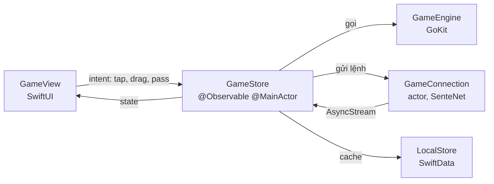
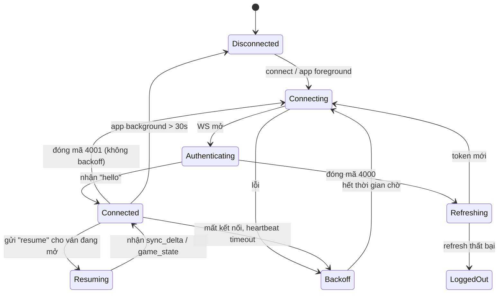

# 07 — iOS App Design

> Kiến trúc ứng dụng iOS. Quyết định nền tảng ở [ADR-001](03-solution-design.md#adr-001--native-ios-thay-vì-cross-platform),
> [ADR-010](03-solution-design.md#adr-010--lưu-trữ-cục-bộ-trên-client-swiftdata),
> [ADR-011](03-solution-design.md#adr-011--render-bàn-cờ-swiftui-canvas).

## 1. Nền tảng

| Mục | Lựa chọn |
|-----|----------|
| Ngôn ngữ | Swift 6, strict concurrency bật hoàn toàn |
| UI | SwiftUI, `@Observable` (Observation framework) |
| iOS tối thiểu | 17.0 |
| Concurrency | `async/await` + `actor`; không dùng Combine cho code mới |
| Persistence | SwiftData |
| Mạng | `URLSession` + `URLSessionWebSocketTask` (không dependency ngoài) |
| Dependency ngoài | **Không có** ở v1.0 — mọi thứ cần thiết đều có trong SDK |

**Vì sao không dùng thư viện ngoài.** App này không cần gì mà SDK không có: WebSocket, JSON,
Keychain, push, deep link đều là API hệ thống. Không dependency nghĩa là không có rủi ro
chuỗi cung ứng, không phải chờ ai đó cập nhật cho iOS mới, và build nhanh. Ngoại lệ duy nhất
có thể chấp nhận sau này: thư viện snapshot testing (chỉ ở target test).

## 2. Cấu trúc module

```
sente-ios/
├── Sente.xcodeproj
├── Packages/
│   ├── GoKit/              # engine luật — Swift thuần, KHÔNG import Foundation UI
│   ├── SenteNet/           # REST + WebSocket + reconnect + auth token
│   └── SenteUI/            # thành phần UI dùng chung, design tokens, BoardView
└── App/
    ├── Core/               # DI container, persistence, push, deep link, app lifecycle
    ├── Features/
    │   ├── Onboarding/
    │   ├── Home/
    │   ├── Invite/
    │   ├── Game/           # màn hình chơi — phức tạp nhất
    │   ├── Scoring/
    │   ├── Replay/
    │   ├── History/
    │   ├── Friends/
    │   └── Settings/
    └── Resources/          # Localizable.xcstrings, assets, sounds
```

**Quy tắc phụ thuộc (một chiều, không có chu trình):**

```
App/Features ──▶ SenteUI ──▶ GoKit
      │            │
      └──────▶ SenteNet ──▶ GoKit
```

`GoKit` không phụ thuộc gì cả — đây là điều kiện để nó test được cạn kiệt và để nó là bản
mirror trung thực của `internal/rules` bên server ([ADR-002](03-solution-design.md#adr-002--nơi-đặt-engine-luật-cờ)).

## 3. GoKit — engine luật

### 3.1 Giao diện công khai

```swift
public struct GameState: Equatable, Sendable {
    public let boardSize: Int
    public let rules: RuleSet
    public let komi: Decimal
    public let cells: [Stone]          // row-major, length boardSize²
    public let toPlay: Player
    public let moveNumber: Int
    public let koPoint: Point?
    public let captures: [Player: Int]
    public let consecutivePasses: Int
    public let phase: Phase
    // positionHistory is kept separately so GameState stays cheap to copy and compare
}

public enum MoveError: Error, Equatable, Sendable {
    case outOfBounds, occupied, notYourTurn, suicide, ko, superko, gameNotPlaying
}

public enum Move: Equatable, Sendable {
    case play(Point), pass, resign
}

public struct GameEngine: Sendable, Equatable {
    public let state: GameState
    public let rules: RuleSet
    public let komi: Double
    public let handicap: Int
    public let history: Set<UInt64>            // every position seen, for superko

    public static func newGame(size: Int, rules: RuleSet, komi: Double?, handicap: Int) -> GameEngine
    public static func position(size: Int, black: [Point], white: [Point], ...) -> GameEngine

    public func validate(_ move: Move) -> Result<Void, MoveError>
    public func validate(_ move: Move, by player: Player) -> Result<Void, MoveError>
    public func apply(_ move: Move) throws -> GameEngine       // returns a NEW engine
    public func legalMoves() -> Set<Point>                     // for a11y and hints
    public func chain(at point: Point) -> Set<Point>
    public func territory(deadStones: Set<Point>) -> TerritoryMap
    public func score(deadStones: Set<Point>) -> Score
}
```

Hai điểm khác với bản phác thảo ban đầu, phát hiện khi cài đặt:

- **`PositionHistory` riêng là thừa.** Lịch sử thế cờ chỉ là `Set<UInt64>` nằm trong engine;
  Swift `Set` có copy-on-write nên `apply` không phải sao chép gì khi state cũ bị bỏ đi.
- **Cần bản `validate(_:by:)` nhận màu quân tường minh.** Server ánh xạ kết nối sang màu
  trước khi biết có phải lượt của màu đó không, nên không thể luôn suy ra từ `toPlay`.
  Đây cũng là cách duy nhất kiểm thử được nhánh `notYourTurn`.

Toàn bộ API là giá trị bất biến: `apply` trả về engine mới. Điều này khiến việc rollback
nước đi lạc quan ([ADR-007](03-solution-design.md#adr-007--đặt-quân-lạc-quan-optimistic--hòa-giải-với-server))
chỉ là giữ lại tham chiếu cũ, và khiến replay/variation trở thành việc tầm thường.

### 3.2 Những gì GoKit **không** làm

- Không biết về mạng, thời gian thực, hay đồng hồ.
- Không có thuật toán **đề xuất** quân chết: phần Monte Carlo chỉ nằm ở server
  ([ADR-009](03-solution-design.md#adr-009--xác-định-quân-chết-benson--monte-carlo-người-quyết-định-cuối)).
  Client chỉ *tính điểm* từ tập quân chết đã cho.
  Riêng **Benson** (sống vô điều kiện) thì GoKit có, vì nó là luật chứ không phải heuristic —
  và vì nhóm vector `life_death/` phải chạy được ở cả hai engine mới có ý nghĩa.
- Không log, không analytics.

Ranh giới này giữ cho GoKit test được bằng 100% dữ liệu thuần và chạy được conformance vectors
không cần mock gì.

## 4. Kiến trúc tầng ứng dụng

Unidirectional: View → Intent → Store → State → View. Dùng `@Observable`, không dùng thư viện
kiến trúc bên ngoài.



### 4.1 `GameStore`

```swift
@MainActor @Observable
final class GameStore {
    // Rendering state, derived and immutable.
    private(set) var board: BoardSnapshot
    private(set) var clock: ClockDisplay
    private(set) var phase: Phase
    private(set) var connection: ConnectionStatus
    private(set) var pendingMove: PendingMove?      // stone shown but not yet acked

    private var confirmed: GameEngine               // last server-confirmed state
    private var optimistic: GameEngine              // confirmed + pendingMove

    func placeStone(at point: Point) { }
    func pass() { }
    func resign() { }
    func handle(_ event: ServerEvent) { }
}
```

**Hai bản engine song song** là trung tâm của thiết kế client:

- `confirmed` — trạng thái server đã xác nhận. Chỉ thay đổi khi nhận `move_made` / `move_ack`.
- `optimistic` — cái người dùng đang nhìn thấy. Bằng `confirmed` cộng thêm nước đi đang chờ.

Rollback = `optimistic = confirmed`. Không có logic "gỡ nước đi ra" nào cả — đó là lý do
GoKit phải bất biến.

### 4.2 Xử lý sự kiện từ server

```swift
func handle(_ event: ServerEvent) {
    switch event {
    case .moveMade(let m):
        guard m.moveNo == confirmed.state.moveNumber + 1 else {
            // Out of order or duplicate: ignore duplicates, resync on a gap.
            if m.moveNo <= confirmed.state.moveNumber { return }
            requestFullSync(); return
        }
        confirmed = try! confirmed.apply(m.move)
        verifyHash(m.boardHash)                 // desync canary
        if pendingMove?.matches(m) == true { pendingMove = nil }
        optimistic = confirmed

    case .moveRejected(let r):
        pendingMove = nil
        optimistic = confirmed                  // rollback is a single assignment
        presentRejection(r)

    case .gameState(let s):
        confirmed = GameEngine(from: s)
        optimistic = confirmed
        pendingMove = nil
    }
}
```

`verifyHash` là chốt phát hiện lệch engine ở phía client: nếu hash cục bộ khác hash server ở
cùng `move_no`, client gửi báo cáo chẩn đoán và yêu cầu full sync ngay.

## 5. Tầng mạng — `SenteNet`

### 5.1 `GameConnection`

```swift
actor GameConnection {
    private var task: URLSessionWebSocketTask?
    private var outbox: [PendingCommand] = []      // survives disconnects
    private var backoff = ExponentialBackoff(base: 1, max: 30, jitter: 0.25)

    let events: AsyncStream<ServerEvent>

    func connect() async
    func send(_ command: ClientCommand) async      // queues if offline
    func resume(gameId: GameID, lastMoveNo: Int, boardHash: UInt64) async
}
```

Là một `actor` nên toàn bộ trạng thái kết nối (outbox, backoff, task) an toàn với concurrency
mà không cần lock. `events` là `AsyncStream` để `GameStore` tiêu thụ trên `@MainActor`.

### 5.2 Vòng đời kết nối



**Hàng đợi lệnh (`outbox`).** Nước đi và chat gửi khi offline được xếp hàng kèm
`client_move_id`, ghi vào SwiftData để sống sót qua việc app bị kill, và gửi lại sau khi
`resume` thành công. Tính idempotent ở server ([ADR-007](03-solution-design.md#adr-007--đặt-quân-lạc-quan-optimistic--hòa-giải-với-server))
đảm bảo không bao giờ tạo ra nước đi trùng.

### 5.3 Vòng đời app và nền

```
Vào nền:
  - Ván live: giữ WS thêm 30 giây (người dùng có thể chỉ chuyển app nhanh), sau đó đóng.
    Đồng hồ vẫn chạy ở server — đây là lý do server phải là trọng tài thời gian.
  - Ván correspondence: đóng WS ngay, không cần giữ.

Quay lại foreground:
  - Kết nối lại + resume TRƯỚC khi render (hiện skeleton), để không chớp thấy trạng thái cũ.
  - Nếu resume xong trong < 300ms thì bỏ qua skeleton hoàn toàn.
```

Không dùng background task để giữ kết nối: iOS sẽ giết nó, tốn pin, và vi phạm
[NFR-P7](01-requirements.md#51-hiệu-năng). Thông báo hết giờ đến qua APNs.

## 6. Bàn cờ — `BoardView`

### 6.1 Phân lớp render

```
ZStack {
  Canvas  ── lớp tĩnh:  gỗ nền, lưới, điểm sao, tọa độ       (vẽ lại khi đổi kích thước)
  Canvas  ── lớp quân:  toàn bộ quân đã xác nhận               (vẽ lại khi bàn cờ đổi)
  ForEach ── lớp động:  quân vừa đặt, quân đang bị bắt,
                        quân pending, đánh dấu nước cuối       (SwiftUI animation)
  Overlay ── lớp phủ:   con trỏ kéo–thả, vùng đất khi đếm điểm
  A11y    ── 361 phần tử accessibility ảo
}
```

Tách hai `Canvas` để lớp tĩnh không phải vẽ lại mỗi frame khi có animation. `drawingGroup()`
cho lớp tĩnh (rasterize một lần).

### 6.2 Cử chỉ đặt quân

Đây là chi tiết UX quan trọng nhất của app — đặt nhầm quân là lỗi không thể hoàn tác.

```
1. Chạm xuống bàn cờ
   → hiện "quân ma" (ghost stone) mờ tại giao điểm gần nhất
   → hiện KÍNH LÚP nhỏ phía trên ngón tay, phóng to vùng quanh giao điểm
2. Kéo ngón tay
   → quân ma bám theo giao điểm gần nhất, có haptic .selection mỗi khi đổi giao điểm
   → nếu giao điểm không hợp lệ: quân ma chuyển màu đỏ + hiện lý do ngắn
3. Nhả ngón tay
   → hợp lệ: đặt quân + haptic .impact(.medium) + âm thanh
   → không hợp lệ: quân ma biến mất + haptic .notification(.warning) + toast lý do
4. Kéo ra ngoài bàn cờ rồi nhả → hủy, không đặt gì
```

**Con trỏ lệch — mặc định tắt.** Trên bàn 19×19, ngón tay che mất giao điểm, nên có tùy
chọn vẽ quân ma lệch lên ~44pt so với điểm chạm. Nhưng nó là **tùy chọn bật trong Cài đặt**,
không phải mặc định: một ô 9×9 chỉ ~40pt nên bất kỳ độ lệch nào cũng đẩy cú chạm sang hàng
trên, và hàng 1 chỉ đặt được bằng cách kéo ra ngoài mép bàn. Bản đầu để mặc định bật và
người dùng phát hiện ngay: *chạm A1 thành A2*.

**Hit testing.** Giao điểm gần nhất theo khoảng cách Euclid, nhưng chỉ chấp nhận nếu khoảng
cách < 0.7 × khoảng cách lưới — tránh đặt quân khi chạm hụt ra ngoài mép bàn.

### 6.3 Hoạt ảnh

| Sự kiện | Hoạt ảnh | Thời lượng |
|---------|----------|-----------|
| Đặt quân (đã xác nhận) | Scale 0.85 → 1.0 + đổ bóng nảy nhẹ | 150ms `.spring` |
| Quân pending | Opacity 0.55, không bóng | — |
| Xác nhận pending | Opacity 0.55 → 1.0 + hoạt ảnh đặt quân | 150ms |
| Bắt quân | Scale 1.0 → 0 + fade, lệch pha 20ms/quân theo khoảng cách | 200ms |
| Rollback | Fade out 120ms + rung ngang nhẹ 2px | 120ms |
| Đánh dấu nước cuối | Chấm tròn nhỏ ở giữa quân, không animation | — |

Tôn trọng `accessibilityReduceMotion`: thay mọi hoạt ảnh bằng cross-fade 100ms.

### 6.4 Accessibility

`Canvas` không sinh accessibility element, phải làm thủ công ([ADR-011](03-solution-design.md#adr-011--render-bàn-cờ-swiftui-canvas)):

```swift
// The board is drawn in a Canvas, so VoiceOver needs an explicit element per
// intersection. 361 lightweight rects, refreshed only when the board changes.
.accessibilityChildren {
    ForEach(board.points) { point in
        Rectangle()
            .frame(width: cellSize, height: cellSize)
            .position(center(of: point))
            .accessibilityLabel(label(for: point))      // "D4, quân đen" / "Q16, trống"
            .accessibilityHint(isLegal(point) ? "Chạm hai lần để đặt quân" : "")
            .accessibilityAddTraits(isLastMove(point) ? .isSelected : [])
    }
}
```

Bổ sung:
- **Rotor tùy chỉnh** "Nước đi gần đây" để nhảy nhanh tới các nước cuối.
- Thông báo VoiceOver khi đối thủ đi: `"Trắng đi Q16, bắt 2 quân"` qua
  `AccessibilityNotification.Announcement`.
- Chế độ ký hiệu cho người mù màu: quân đen có chấm trắng ở giữa, quân trắng có vòng đen
  ([NFR-A11Y3](01-requirements.md#55-khả-năng-tiếp-cận--bản-địa-hóa)).

### 6.5 Hiệu năng

- Không tạo `Path` mới mỗi frame: cache path lưới theo kích thước bàn.
- Quân vẽ bằng `context.fill(Path(ellipseIn:))` với gradient dựng sẵn, không dùng ảnh.
- Mục tiêu: 60fps trên iPhone 12 khi có 10 quân đang animation. Đo bằng Instruments
  (Animation Hitches) trước mỗi release.

## 7. Lưu trữ cục bộ (SwiftData)

```swift
@Model final class CachedGame {
    @Attribute(.unique) var id: UUID
    var boardSize: Int
    var phase: String
    var updatedAt: Date
    var stateBlob: Data                  // encoded GameState snapshot
    @Relationship(deleteRule: .cascade) var moves: [CachedMove]
}

@Model final class OutboxCommand {
    @Attribute(.unique) var clientMoveId: UUID
    var gameId: UUID
    var payload: Data
    var createdAt: Date
    var attempts: Int
}

@Model final class LocalGame {                // pass-and-play, không đồng bộ lên server
    @Attribute(.unique) var id: UUID
    var stateBlob: Data
    var moves: [CachedMove]
}
```

**Ranh giới rõ ràng:** `CachedGame` là cache thuần — xóa được bất cứ lúc nào.
`OutboxCommand` và `LocalGame` là dữ liệu **duy nhất** ở client, phải được sao lưu qua
iCloud backup của hệ thống. Dọn cache: giữ 50 ván gần nhất, xóa ván đã kết thúc quá 30 ngày.

## 8. Danh sách màn hình

| Màn hình | Nội dung chính | Ưu tiên |
|----------|----------------|---------|
| Onboarding | 3 bước: chào, chọn trình độ (quyết định cỡ bàn mặc định), xin quyền push | P0 |
| Home | Ván đang chờ bạn đi (nổi bật nhất), ván đang chờ đối thủ, nút "Mời bạn chơi", nút "Chơi trên máy này" | P0 |
| Học cờ vây | Bài học tương tác (FR-M8): nội dung là dữ liệu (`App/Resources/Lessons.json`, song ngữ vi/en, 4 chương · 21 bài · 53 bước — luật, khí, đám quân, bắt quân, atari, tự sát, ko, lãnh thổ, đánh đôi, bắt hồi, đuổi biên, **đuổi thang** (trường `atariAt`: test khẳng định sau mỗi nước đuổi đám trắng còn đúng 1 khí — thang ép thật), bắt ngược, hai mắt, điểm trọng yếu, mắt giả, thẳng bốn, cong ba, góc trước, cắt/nối, phòng đánh đôi, tổng hợp). Mỗi bước là *info* (bàn cờ + điểm đánh dấu, dùng lớp chấm territory của `BoardView` làm marker) hoặc *task* (đặt đúng nước → engine GoKit áp thật, có kịch bản trắng đáp, sai giữ nguyên và báo; bước không có `board` nối tiếp thế cờ bước trước). `LessonContentTests` phát lại **toàn bộ** file qua engine: thế cờ 9 hàng × 9 cột, nước đúng hợp lệ, số quân bắt khớp `captures` — nội dung sai là CI đỏ. Tiến độ trong UserDefaults; Home hiện x/15; launch arg `-openLearn 1` | P1 |
| Đấu với máy / Máy đấu máy | Bot offline (FR-M9): `GoBot` trên GoKit, 4 cấp — Mới tập (ngẫu nhiên có nết, vẫn nhặt quân biếu), Biết bắt quân (tham ăn: bắt/cứu atari, né tự-atari), Tính một nước (trừ điểm đám mình còn 1 khí sau nước đi), Suy nghĩ sâu (Monte-Carlo trên top ứng viên, trộn heuristic vì số playout cỡ điện thoại quá thưa). Ứng viên lấy từ `legalMoves()` trừ mắt thật của mình (luật mắt giả theo chéo) → không bao giờ đi sai luật, không tự lấp mắt; nghĩ trên `Task.detached`; RNG `SplitMix64` có seed để test phát lại. Bot là **ghế** trong `LocalGameStore` (`blackBot`/`whiteBot`): người-máy dùng lại nguyên bàn/đếm điểm/lưu ván (file `bot-game.json` riêng), máy-máy tự đếm khi hai bên nhường lượt, có tạm dừng. Test: 4 ván seed cố định "Tính một nước" phải thắng "Mới tập" ≥3; fuzz kết thúc ván; không lấp mắt qua 20 seed × 4 cấp | P1 |
| Chơi trên máy này | Pass-and-play (FR-M5): thiết lập (cỡ bàn, luật, chấp, tên hai người) → bàn cờ dùng lại `BoardView`, ai tới lượt thì đặt; nhường lượt, đi lại một nước (không cần hỏi — cả hai đang nhìn), xin thua, hai lần nhường → đánh dấu quân chết → Đếm điểm hoặc Chơi tiếp; chia sẻ SGF. Hoàn toàn offline: `LocalGameStore` trên GoKit, ván đang chơi lưu `local-game.json` trong Application Support và mở lại được từ Home | P1 |
| Chia sẻ lời mời | Mã QR (CoreImage, chứa `share_url` — universal link — hoặc `sente://j/<mã>` khi server không có URL công khai), mã 8 chữ, nút Chia sẻ. Bên nhận: "Nhập mã lời mời" có nút **Quét mã QR** (AVFoundation, `NSCameraUsageDescription`); ô nhập cũng nhận cả link dán vào (`InviteCode.parse`). Simulator không có camera → màn quét báo rõ, không crash | P0 |
| Tạo lời mời | Chọn cỡ bàn (9/13/19), thể thức (tính giờ: thời gian chính + byo-yomi; thư tín: ngày/nước), luật, chấp, màu. Ba preset chỉ là nút điền nhanh. Danh sách thời gian cắt theo trần của cỡ bàn (`TimeLimits`, phản chiếu `game.MaxMainTime`); đổi bàn nhỏ hơn thì thời gian đang chọn kẹp về trần | P0 |
| Xem trước lời mời | Ai mời, cấu hình gì, Chấp nhận / Từ chối | P0 |
| **Ván cờ** | Bàn cờ, hai đồng hồ, tù binh, nút Pass/Xin thua/Chat, banner trạng thái kết nối | P0 |
| Đếm điểm | Bàn cờ với quân chết mờ + đất tô màu, tỉ số trực tiếp, Đồng ý / Chơi tiếp | P0 |
| Kết quả | Người thắng, phân tích tỉ số, nút Chơi lại / Xuất SGF / Xem lại | P0 |
| Replay | Bàn cờ + thanh tua nước đi + chat theo nước, cho phép thử biến hóa | P1 |
| Lịch sử | Danh sách ván, bộ lọc | P0 |
| Bạn bè | Danh sách, mã bạn bè của tôi, thêm bạn | P1 |
| Cài đặt | Tài khoản, thông báo, hiển thị bàn cờ, âm thanh/haptic, riêng tư, xóa tài khoản | P0 |

### 8.1 Chi tiết màn hình ván cờ

```
┌──────────────────────────────────┐
│ ← binh (Trắng)   10:32  ⚫4  [3] │  ← đối thủ: tên, đồng hồ, tù binh, kỳ byo-yomi
│                                  │
│   ┌────────────────────────┐     │
│   │                        │     │
│   │      B À N   C Ờ       │     │  ← chiếm tối đa chiều rộng, luôn vuông
│   │                        │     │
│   └────────────────────────┘     │
│                                  │
│ ⏺ an (Đen)      08:45  ⚪2  [3] │  ← mình: chấm đỏ = đang tới lượt
│ ─────────────────────────────── │
│  [ Nhường lượt ]  [ 💬 ]  [ ⋯ ] │  ← Xin thua nằm trong ⋯ để tránh bấm nhầm
└──────────────────────────────────┘
```

Quy tắc bố cục:
- Bàn cờ **luôn vuông** và căn giữa; phần thừa dồn cho vùng thông tin.
- Trên iPhone nhỏ (SE), thu gọn vùng thông tin, không bao giờ thu nhỏ bàn cờ.
- Thông tin đối thủ ở **trên**, mình ở **dưới** — quy ước phổ quát của game cờ.
- Nút "Xin thua" đặt trong menu phụ, có xác nhận hai bước.

### 8.2 Trạng thái kết nối hiển thị cho người dùng

| Trạng thái | Hiển thị | Có chặn thao tác không |
|-----------|----------|------------------------|
| Connected | Không hiện gì | Không |
| Reconnecting < 3s | Không hiện gì (tránh nhấp nháy) | Không |
| Reconnecting ≥ 3s | Banner vàng "Đang kết nối lại…" | Không — vẫn đi được, vào hàng đợi |
| Offline > 30s | Banner đỏ "Mất kết nối. Nước đi sẽ được gửi khi có mạng." | Không |
| Đang đồng bộ | Overlay mờ + spinner trên bàn cờ | Có, < 1 giây |
| Cần cập nhật app | Màn hình chặn toàn phần | Có |

**Nguyên tắc:** không bao giờ chặn người chơi đặt quân vì lý do mạng. Nước đi vào hàng đợi.
Chỉ chặn khi đang đồng bộ (rất ngắn) hoặc khi protocol không tương thích.

## 9. Deep link và push

### 9.1 Universal Link

```
https://sente.app/j/<code>     → xem trước lời mời
https://sente.app/g/<game_id>  → mở ván (dùng cho push và chia sẻ)
```

`apple-app-site-association` host trên CloudFront. Khi app chưa cài, landing page hiển thị
preview cấu hình ván và nút tới App Store; sau khi cài, app gọi `/v1/invites/pending`
([ADR-012](03-solution-design.md#adr-012--mời-bạn-qua-universal-link-có-xử-lý-deferred)).

### 9.2 Xử lý push

```swift
// Deep-link payloads are routed through one place so cold start, background,
// and foreground all follow the same path.
func handle(notification userInfo: [AnyHashable: Any]) {
    guard let route = DeepLinkRoute(userInfo) else { return }
    router.pending = route          // consumed once the app is ready to navigate
}
```

Trường hợp phải xử lý đúng:
- **Cold start từ push** → app phải điều hướng tới ván sau khi khôi phục session, không phải
  trước (nếu không sẽ hiện màn hình rỗng).
- **Push khi đang ở trong chính ván đó** → không điều hướng, chỉ cập nhật (WS đã lo).
- **Push cho ván đã kết thúc** → mở màn hình kết quả, không mở bàn cờ.

> **Sửa lại khi cài đặt (2026-08-29).** SwiftUI không có chỗ nhận device token, nên có một
> `AppDelegate` nhỏ (`Core/PushRegistrar.swift`) qua `@UIApplicationDelegateAdaptor`; nó chỉ
> chuyển token hex cho `AppSession.deviceTokenReceived` (→ `POST /v1/devices`, gọi lại mỗi lần
> mở app) và chuyển `game_id` của push được chạm vào `pendingGameID` — đúng đường đi của deep
> link, nên cold start và foreground giống nhau. `PushRegistrar.visibleGameID` do `GameView`
> đặt; push của ván đang mở bị giữ lại trong `willPresent`. Xin quyền **sau khi có ván đầu**
> (`registerForPushIfUseful` trong `refresh()`), không hỏi ở lần mở app đầu; bị từ chối thì
> Cài đặt chỉ còn nút mở Cài đặt hệ thống. Môi trường APNs lấy từ `#if DEBUG` (sandbox) —
> TestFlight và App Store là production.

## 10. Design system (`SenteUI`)

| Token | Sáng | Tối |
|-------|------|-----|
| `board.surface` | `#E8B96A` (gỗ nhạt) | `#8B6F3E` |
| `board.line` | `#3A2E1E` @ 70% | `#1A1206` @ 80% |
| `stone.black` | Gradient `#2B2B2B` → `#0A0A0A` | như sáng |
| `stone.white` | Gradient `#FFFFFF` → `#DDDAD2` | như sáng |
| `territory.black` | `#000000` @ 22% | `#000000` @ 30% |
| `territory.white` | `#FFFFFF` @ 40% | `#FFFFFF` @ 30% |
| `state.turn` | `#E5484D` | `#FF6369` |

- Bàn cờ **giữ nguyên tông gỗ ở dark mode** (chỉ tối đi), không đảo màu — người chơi cờ
  nhận diện bàn qua màu gỗ.
- Mọi màu chrome là **token thích ứng** (`Tokens.adaptive(light:dark:)` bọc `UIColor` động),
  không phải hằng số. Bản đầu để `paper`/`ink` là màu sáng cố định nên bật dark mode chỉ đổi
  chrome hệ thống, nền vẫn kem. Người dùng chọn Hệ thống / Sáng / Tối trong Cài đặt;
  `preferredColorScheme(nil)` là theo hệ thống.
- **Icon** vẽ bằng CoreGraphics (`sente-ios/scripts/render-icon.swift`): quân đen có vệt
  sáng lệch trên nền gỗ với lưới và chấm son — đúng mô tả thương hiệu. Sinh lại được ở
  mọi kích cỡ, hai biến thể sáng/tối, không cần công cụ thiết kế.
- Typography: SF Pro, dùng text style chuẩn để Dynamic Type hoạt động; chỉ tọa độ bàn cờ dùng
  cỡ cố định (scale theo cỡ bàn, không theo Dynamic Type).
- Âm thanh: tiếng đặt quân (3 biến thể ngẫu nhiên tránh lặp máy móc), tiếng bắt quân, tiếng
  báo sắp hết giờ. Tôn trọng chế độ im lặng.

## 10.1 Ngôn ngữ (tiếng Việt, tiếng Anh)

Mặc định theo ngôn ngữ máy; iOS tự thêm mục chọn ngôn ngữ riêng cho Sente trong Cài đặt hệ
thống khi bundle có hai ngôn ngữ, và Cài đặt của app có hàng "Ngôn ngữ" mở thẳng tới đó.

Cách làm — **String Catalog, khóa là tiếng Việt**:
- `developmentLanguage: vi` trong `project.yml`; chuỗi trong code giữ nguyên tiếng Việt và là
  khóa. `App/Resources/Localizable.xcstrings` (`sourceLanguage: vi`) chỉ chứa bản dịch Anh.
  Thiếu bản dịch thì hiện tiếng Việt, không bao giờ hiện khóa kỹ thuật.
- Chuỗi đưa vào `Text`, `Button`, `Label`, `Section`, `Picker`, `TextField`,
  `navigationTitle`, `confirmationDialog`, `alert`, `LabeledContent`… tự tra catalog (kiểu
  `LocalizedStringKey`). Chuỗi kiểu `String` (toast, lỗi, `switch` trả chuỗi, tên mặc định,
  nhánh của toán tử ba ngôi) **phải** bọc `String(localized:)` — tam ngôi
  `Text(a ? "x" : y)` với `y` không phải literal là `String`, không tự dịch.
- Package `SenteNet`/`SenteUI` không có catalog riêng: dùng `String(localized:, bundle: .main)`
  để tra catalog của app; khóa của chúng thêm tay vào catalog vì Xcode chỉ trích từ target app.
- `xcodebuild` **không** ghi khóa vào catalog (chỉ Xcode IDE làm). Cách lấy: build với
  `SWIFT_EMIT_LOC_STRINGS=YES` (đã bật) rồi gom các file `*.stringsdata` trong DerivedData —
  JSON `{tables: {Localizable: [{key}]}}` — thành catalog; khóa chưa có bản dịch để trống.
- `InfoPlist.xcstrings`: tên app và `NSCameraUsageDescription`.
- Push: server gửi `title-loc-key` / `loc-key` / `loc-args` (`push.turn.*`, `push.invite.*`,
  `push.end.<win|lose|draw>.<lý do>`), máy tự chọn tiếng — nội dung Việt vẫn gửi kèm làm dự
  phòng cho bản app cũ.
- Test so với `String(localized:)` của cùng khóa, nên chạy đúng ở simulator mọi ngôn ngữ.
- Chưa dịch: thông điệp lỗi server trả về (`error.message`), landing page `/j/<mã>`.

## 11. Xử lý lỗi

```swift
enum AppError: Error {
    case network(URLError)
    case server(code: String, message: String)     // message đã bản địa hóa từ server
    case rules(MoveError)
    case desync
    case needsUpdate
}
```

Nguyên tắc hiển thị:

| Loại | Cách hiện | Ví dụ |
|------|-----------|-------|
| Lỗi luật khi đặt quân | Toast 2 giây ở cạnh dưới bàn cờ + haptic | "Nước này tự sát" |
| Lỗi mạng tạm thời | Banner, tự biến mất | "Đang kết nối lại…" |
| Lỗi server có ý nghĩa | Alert với hành động cụ thể | "Lời mời đã hết hạn" + nút Tạo lời mời mới |
| Desync | Overlay đồng bộ, không alert | — |
| Lỗi không rõ | Alert chung + gửi báo cáo chẩn đoán | "Có lỗi xảy ra. Vui lòng thử lại." |

**Không bao giờ** hiện mã lỗi kỹ thuật hay stack trace cho người dùng. `trace_id` được đính
kèm âm thầm vào báo cáo chẩn đoán để đối chiếu với log server.

## 12. Kiểm thử phía client

| Loại | Phạm vi | Công cụ | Mục tiêu |
|------|---------|---------|----------|
| Unit — GoKit | Toàn bộ luật + conformance vectors | XCTest | **95% dòng, 90% nhánh** |
| Property-based | Sinh ván ngẫu nhiên, bất biến: replay = state hiện tại; apply rồi rollback = state cũ | XCTest tự viết generator | — |
| Unit — Store | Hòa giải optimistic/confirmed, xử lý sự kiện lệch thứ tự | XCTest với `FakeTransport` (protocol `GameTransport`; `GameConnection` là bản thật) | 85% |
| Snapshot | `BoardView` ở các cỡ bàn × sáng/tối × Dynamic Type | swift-snapshot-testing (chỉ target test) | Các thế cờ chuẩn |
| Integration | `GameConnection` với server WS giả (local) | XCTest | Reconnect, resume, outbox |
| UI (XCUITest) | 5 luồng: tạo lời mời, chấp nhận, chơi trọn ván 9×9, đếm điểm, khôi phục sau khi kill app | XCUITest | Chạy trên CI mỗi PR |
| Thủ công | Mất mạng thật, chuyển 4G↔WiFi, chế độ nguồn thấp, VoiceOver | Checklist | Trước mỗi release |

Chi tiết chiến lược ở [09-testing-strategy.md](09-testing-strategy.md).

## 12.1 Ghi chú khi cài đặt bản đầu

Ba điều lộ ra ngay ở lần chạy đầu trên simulator, đều đã sửa:

- **`game_state` không nói người xem là màu gì** — nó mô tả ván, không mô tả người xem.
  `GameStore` nhận `myColor` từ danh sách ván (`GET /v1/games`), không suy từ socket. Bản
  đầu mặc định Đen nên hai hàng người chơi hiển thị đảo.
- **Thiếu `last_move` trong `game_state` phía server** dù §3.4 của tài liệu 06 có. Không có
  nó, chấm son nước cuối chỉ hiện từ nước tiếp theo. Đã bổ sung server.
- **Build simulator với `CODE_SIGNING_ALLOWED=NO` làm Keychain từ chối ghi** — app không
  có entitlement nào. Hậu quả: mỗi lần mở app là một tài khoản khách mới, ván cũ mất hết.
  Ký ad-hoc (`CODE_SIGN_IDENTITY="-"`) là đủ. `TokenStore.save` giờ trả về `Bool` và
  `AppSession` coi thất bại là lỗi, không nuốt.

Sáu launch argument phục vụ kiểm thử, script và chụp màn hình: `-openGame <id>`,
`-inviteCode <code>`, `-createInvite 1` (mở sheet tạo lời mời), `-openSettings 1` (mở Cài đặt),
`-openLocal 1` (mở chơi trên máy này), `-openLearn 1` (mở bài học), `-openBot 1` (đấu với máy),
`-openWatch 1` (máy đấu máy).
Cả hai được tiêu thụ trong `onAppear` của Home, không chỉ `onChange` — giá trị đã có sẵn
trước khi Home xuất hiện nên `onChange` không bao giờ bắt được (đã sập bẫy này hai lần).
Chuỗi hiển thị thời gian **không** dùng relative formatter của hệ thống: nó theo locale máy
và cho ra "Hết hạn next week" trên simulator tiếng Anh.
Deep link `sente://g/<id>` và `sente://j/<code>` hoạt động nhưng iOS hỏi xác nhận khi mở từ
ngoài app — không tự động được trong XCUITest, nên dùng launch argument.

**Xin hoãn (undo).** Lỗi gặp thật: hai bên đồng ý hoãn nhưng bàn cờ không lùi, Trắng không
đánh được, Đen đánh thì "chưa tới lượt". Nguyên nhân: `undo_result` chỉ hiện toast. Client
không thể tự lùi (quân bị bắt không khôi phục được từ hash), nên giờ nó **khóa thao tác**
(`awaitingState`) và giữ bàn cờ cũ cho tới `game_state` server gửi ngay sau. Cùng lúc phát hiện
ba đường "đồng bộ lại" (hụt nước, sai hash, `resync_required`) chỉ xóa bàn cờ mà không xin
lại — giờ có lệnh `resume`. Phía server còn nặng hơn: nước bị hoãn vẫn nằm trong `moves`, ván
sẽ không load lại được sau 5 phút idle (lệch checksum) — đã sửa bằng `Games.Rewind`. Cùng
họ: **"chơi tiếp" từ đếm điểm** để lại các nước pass và hàng `game_scoring` trong DB, nên
`game_state` gửi sau `resync_required` nói ván vẫn đang đếm điểm trong khi actor đã chơi —
hai bên không làm được gì. `Rewind` giờ dùng cho cả `PlayResumed`.

**Link mời đến khi đang mở sheet khác thì mất.** Gặp thật khi quét QR bằng Camera: app mở
nhưng không hiện lời mời. Home có hai `.sheet` (tạo lời mời, nhập mã) trên cùng một view;
SwiftUI chỉ trình bày một sheet nên sheet thứ hai bị bỏ qua không báo gì, và nếu chính sheet
nhập mã đang mở thì `JoinView` giữ `@State code` cũ. Giờ Home có **một** `.sheet(item:)` với
`HomeSheet { create, join(code) }` — link đến là thay sheet đang mở — và `JoinView` gắn
`.id(code)` để mã mới tạo view mới, tra ngay. Kiểm bằng `simctl openurl https://…/j/<mã>` khi
sheet tạo lời mời đang mở và khi app chưa chạy.

**Tên từ Apple chỉ đến một lần.** Apple trả `fullName` duy nhất ở lần cấp quyền đầu cho app;
mọi lần sau đều trống — kể cả sau khi xóa tài khoản Sente và đăng nhập lại (câu hỏi gặp thật:
"sao tên không đổi theo Apple ID"). Muốn Apple gửi lại phải vào Cài đặt iOS → Apple Account →
Đăng nhập & Bảo mật → Đăng nhập bằng Apple → Sente → Ngừng sử dụng. Vì vậy tên trong Cài đặt
tự sửa được (`PATCH /v1/me`), và tên Apple gửi được ghép theo thứ tự Việt họ–đệm–tên
(`AppleName`), formatter hệ thống đảo thành "Tính Bùi".

**Sign in with Apple** nằm trong Cài đặt → Tài khoản (`SignInWithAppleButton`), chỉ hiện khi
`is_guest`. Nonce sinh mới mỗi lần vào màn hình, gửi Apple dạng SHA-256 và gửi server dạng
gốc. Tên đầy đủ chỉ có ở lần đầu nên đưa lên server ngay. Sau khi liên kết `AppSession.adopt`
nhận cặp token mới — cùng hàm với đăng ký khách. Hủy sheet không phải lỗi, không hiện gì.
Entitlements (`App/Resources/Sente.entitlements`): `aps-environment`, `applesignin`,
`applinks:sente.devlord.net`; `DEVELOPMENT_TEAM` nằm trong `project.yml`.

## 12.2 Phát hành TestFlight

`make testflight` (`scripts/testflight.sh`): `xcodegen generate` → `xcodebuild archive` Release,
đích `generic/platform=iOS`, ký tự động bằng API key App Store Connect (`ASC_KEY_ID`,
`ASC_ISSUER_ID`, `ASC_KEY_FILE` — file `.p8` để trong `deploy/secret/`, không commit) →
`-exportArchive` với `method: app-store-connect`, `destination: upload`. Build number =
`git rev-list --count HEAD`, nên mỗi lần upload luôn cao hơn lần trước; phiên bản lấy từ
`MARKETING_VERSION` trong `project.yml` — Info.plist phải trỏ `CFBundleShortVersionString`/`CFBundleVersion` vào hai biến này, vì xcodegen mặc định ghi cứng `1.0`/`1` (bản upload đầu đã dính). Lần đầu nên archive qua Xcode để nó tạo chứng chỉ
Apple Distribution; bản TestFlight là Release nên đăng ký push môi trường `production` và
`aps-environment` tự thành production theo profile App Store.

## 13. Những chỗ dễ sai đã biết

Ghi ra để review PR có thứ để đối chiếu:

1. **`move_made` đến trước `move_ack`** — thứ tự không đảm bảo. Phải khử trùng lặp theo
   `move_no`, không dựa vào thứ tự đến.
2. **Nước đi từ chính mình vọng lại qua broadcast** — nếu áp dụng lần hai sẽ lệch bàn cờ.
3. **Đồng hồ chạy khi app ở nền** — `Timer` bị dừng. Khi foreground phải tính lại từ
   `move_deadline`, không cộng dồn từ giá trị cũ.
4. **`Date()` bị người dùng chỉnh** — luôn dùng `move_deadline` + offset đã hiệu chỉnh, không
   dùng thời gian thiết bị trực tiếp.
5. **Kill app khi outbox còn lệnh** — phải ghi SwiftData *trước* khi gửi, không phải sau.
6. **Xoay màn hình giữa lúc kéo quân** — hủy gesture, không đặt quân.
7. **Cuộc gọi đến / Face ID che app giữa ván** — coi như vào nền, xử lý như §5.3.
8. **VoiceOver bật giữa ván** — 361 element phải được tạo lại đúng, không được rỗng.
