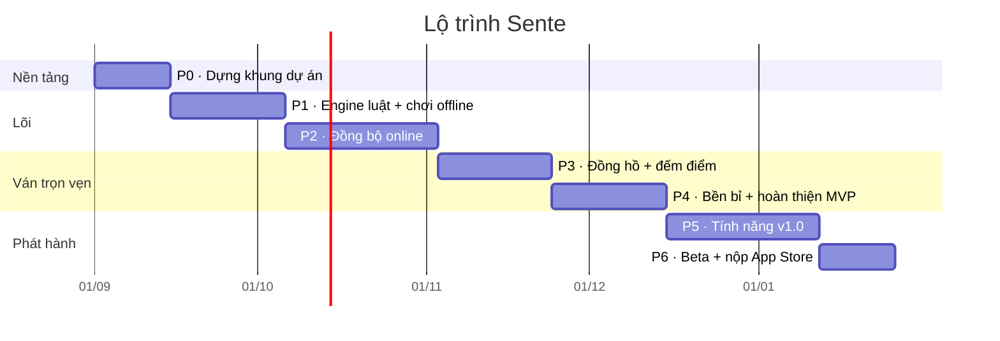

# 10 — Roadmap

> Kế hoạch phân kỳ từ con số không tới v1.0 trên App Store.
> Giả định đội hình: **1 iOS dev + 1 backend dev**, sprint 2 tuần ([C1](01-requirements.md#8-ràng-buộc)).
> Nếu đội hình khác, ước lượng tuần thay đổi nhưng **thứ tự các giai đoạn thì không** —
> thứ tự này được chọn để rủi ro lớn nhất bị đánh gục sớm nhất.

## Nguyên tắc phân kỳ

**Làm phần khó nhất trước, không phải phần dễ nhìn nhất.** Engine luật và cơ chế đồng bộ là
hai thứ có thể giết dự án; màn hình Cài đặt thì không. Vì vậy giai đoạn 1 và 2 không tạo ra
gì đẹp để khoe, nhưng chúng loại bỏ toàn bộ rủi ro kỹ thuật.

**Mỗi giai đoạn kết thúc bằng một thứ chạy được thật**, không phải một thư viện đã xong.

## Tổng quan

| Giai đoạn | Thời lượng | Cột mốc | Tích lũy |
|-----------|-----------|---------|----------|
| P0 — Nền tảng | 2 tuần | Khung dự án chạy được, CI xanh | T2 |
| P1 — Engine + offline | 3 tuần | Chơi pass-and-play trên máy, đúng luật | T5 |
| P2 — Online | 4 tuần | Hai thiết bị đi nước cho nhau qua mạng | T9 |
| P3 — Đồng hồ + đếm điểm | 3 tuần | **Ván trọn vẹn từ đầu tới kết quả** | T12 |
| P4 — Bền bỉ + MVP | 3 tuần | **MVP đạt tiêu chí nghiệm thu** | T15 |
| P5 — v1.0 | 4 tuần | Replay, SGF, bạn bè, correspondence | T19 |
| P6 — Beta + nộp | 2 tuần | Trên App Store | **T21** |

≈ **5 tháng** tới khi lên App Store, với MVP dùng được nội bộ từ tuần 15.

---

## P0 — Nền tảng (tuần 1–2)

**Mục tiêu:** loại bỏ mọi ma sát về công cụ trước khi viết logic.

| Backend | iOS |
|---------|-----|
| Repo + cấu trúc gói theo [04 §10](04-architecture.md#10-bản-đồ-mã-nguồn) | Xcode project + 3 SPM package rỗng |
| Docker Compose: PostgreSQL + Redis | Cấu hình build, scheme, signing |
| Migration đầu tiên (`users`, `games`, `moves`) | SwiftLint + strict concurrency bật |
| Health check + OTel + structured log | CI: build + test + upload TestFlight |
| CI: lint, test, coverage gate, govulncheck | Design tokens cơ bản trong `SenteUI` |
| Repo `rules-spec` + hằng số Zobrist | Submodule `rules-spec` |

**Điều kiện hoàn thành.**
- [ ] `docker compose up` cho backend chạy được, `/healthz` trả 200.
- [ ] CI của cả hai repo xanh, coverage gate hoạt động (thử làm fail để xác nhận).
- [ ] TestFlight nhận được build đầu tiên (app rỗng cũng được).
- [ ] `rules-spec/zobrist_table.json` cố định và nạp được từ cả hai bên.
- [ ] **Chốt tên thương hiệu:** tra nhãn hiệu "Sente" (USPTO/WIPO nhóm 9 & 41 + App
      Store), mua `sente.app`, đăng ký bundle id `app.sente.go` trên App Store Connect.
      Dự phòng nếu vướng: **Hoshi**. Xem [README § Tên sản phẩm](README.md#tên-sản-phẩm).

> Đừng bỏ qua việc thiết lập coverage gate và TestFlight ở P0. Làm sau luôn tốn gấp đôi.

---

## P1 — Engine luật + chơi offline (tuần 3–5)

**Mục tiêu:** rủi ro số một của dự án bị đánh gục ngay lập tức.

Cả hai dev cùng làm engine, mỗi người một ngôn ngữ, **theo TDD với vectors viết trước**. Đây
là ngoại lệ hiếm hoi mà làm trùng lặp là đúng — nó chính là cơ chế xác minh chéo.

| Tuần | Backend (Go) | iOS (Swift) | Chung |
|------|--------------|-------------|-------|
| 3 | `board`, `chain`, `liberties`, `capture` | như bên trái, bằng Swift | Viết 200 vector đầu (legality, capture, suicide) |
| 4 | `ko`, `superko`, Zobrist, `applyMove` | như bên trái | Thêm 100 vector (ko, superko, life/death) |
| 5 | `score` Nhật + Trung, `benson`, SGF | `score`, SGF, **BoardView + gesture** | 100 vector scoring/handicap + differential test |

**Điều kiện hoàn thành.**
- [ ] 400+ conformance vectors, **cả hai engine pass 100%**.
- [ ] Coverage `rules`/`GoKit` ≥ 95% dòng, ≥ 90% nhánh.
- [ ] Differential test 10.000 ván ngẫu nhiên: Go ≡ Swift ≡ GNU Go.
- [ ] Replay 1.000 ván SGF chuyên nghiệp không lỗi.
- [ ] **App chơi được pass-and-play**: hai người trên một máy, chơi trọn ván 9×9, đếm điểm
      (đánh dấu quân chết thủ công), ra kết quả đúng.

> Cột mốc "chơi pass-and-play" là thứ chứng minh engine đúng theo cách mà không bộ test nào
> thay thế được. Nó cũng là [FR-M5](01-requirements.md#42-tạo-và-ghép-ván), nên không phí công.

---

## P2 — Đồng bộ online (tuần 6–9)

**Mục tiêu:** rủi ro số hai — đồng bộ thời gian thực — bị đánh gục.

| Tuần | Backend | iOS |
|------|---------|-----|
| 6 | Auth: guest, Apple, JWT + rotation. Schema đầy đủ | Keychain, auth flow, onboarding |
| 7 | WS gateway, protocol, `subscribe`/`move`/`move_made` | `GameConnection` actor, `GameStore`, optimistic + rollback |
| 8 | GameActor, lease Redis, định tuyến xuyên node, ghi DB | Reconnect + backoff, outbox SwiftData, `resume` |
| 9 | Challenge API, Universal Link, landing page | Màn hình tạo/xem trước lời mời, deep link |

**Điều kiện hoàn thành.**
- [ ] Hai thiết bị thật đi nước qua lại được, thấy nước của nhau trong < 500ms trên 4G.
- [ ] Đứt mạng 60 giây → khôi phục, không mất nước đi, không nước trùng.
- [ ] Kill app → mở lại → ván khôi phục đúng thế cờ.
- [ ] Ép hai người chơi lên hai node khác nhau → vẫn hoạt động (test bằng 2 container).
- [ ] Chaos test cơ bản: kill node sở hữu → ván khôi phục ≤ 10 giây.
- [ ] Luồng [J1](01-requirements.md#j1--rủ-bạn-chơi-ván-đầu-tiên-p0) chạy được đầu-cuối.

> Chưa có đồng hồ ở giai đoạn này — ván chơi vô hạn thời gian. Điều đó là **cố ý**: tách hai
> nguồn phức tạp ra khỏi nhau để debug được.

---

## P3 — Đồng hồ + đếm điểm (tuần 10–12)

**Mục tiêu:** ván cờ có kết thúc thật.

| Tuần | Backend | iOS |
|------|---------|-----|
| 10 | 4 thể thức thời gian, timer, `chargeClock`, bù trễ có trần | Hiển thị đồng hồ, hiệu chỉnh offset qua ping/pong, cảnh báo sắp hết giờ |
| 11 | Phase scoring, `mark_dead`, đàm phán, Benson + Monte Carlo | Màn hình đếm điểm: quân chết mờ, đất tô màu, tỉ số trực tiếp |
| 12 | `game_over`, lưu result, xử lý tranh chấp/chơi tiếp | Màn hình kết quả, luồng tranh chấp |

**Điều kiện hoàn thành.**
- [ ] Ván 19×19 byo-yomi trọn vẹn giữa hai thiết bị, kết thúc đếm điểm, kết quả đúng.
- [ ] Hết giờ ở kỳ byo-yomi cuối → cả hai thấy kết quả cùng lúc, không ai thấy "còn giờ".
- [ ] Đề xuất quân chết đúng trong 20/20 ván test thủ công (bàn 9×9 và 13×13).
- [ ] Tranh chấp → chơi tiếp → thế cờ quay lại đúng chỗ ([E6](09-testing-strategy.md#6-end-to-end)).
- [ ] Đồng hồ chạy đúng khi app vào nền rồi quay lại.

---

## P4 — Bền bỉ và hoàn thiện MVP (tuần 13–15)

**Mục tiêu:** đạt [tiêu chí nghiệm thu MVP](01-requirements.md#10-tiêu-chí-nghiệm-thu-mvp).

| Tuần | Backend | iOS |
|------|---------|-----|
| 13 | Push APNs (đến lượt, sắp hết giờ, ván kết thúc), worker | Xử lý push + deep link từ push, quyền thông báo |
| 14 | Chaos test đầy đủ, drain khi deploy, reaper, sweeper | Trạng thái kết nối trong UI, xử lý lỗi, hoạt ảnh, haptic, âm thanh |
| 15 | Rate limit, xóa tài khoản, report/block, dashboard + alert | Accessibility (361 element, rotor, thông báo), Cài đặt, xóa tài khoản |

**Điều kiện hoàn thành = MVP.**
- [ ] Toàn bộ 8 mục ở [01 §10](01-requirements.md#10-tiêu-chí-nghiệm-thu-mvp) đạt.
- [ ] Chaos test đầy đủ pass ([09 §4.4](09-testing-strategy.md#44-chaos-test--bắt-buộc-trước-release)).
- [ ] Load test baseline (1.000 ván) đạt ngưỡng.
- [ ] Chơi trọn ván 9×9 chỉ bằng VoiceOver.
- [ ] 100 ván test nội bộ không crash.

> **Đây là điểm dừng an toàn.** Nếu buộc phải phát hành sớm, sản phẩm ở đây đã dùng được:
> mời bạn, chơi realtime, đếm điểm, push. Thiếu replay, SGF, correspondence, danh sách bạn bè.

---

## P5 — Tính năng v1.0 (tuần 16–19)

| Tuần | Nội dung | Yêu cầu |
|------|----------|---------|
| 16 | Ván correspondence: REST move, deadline, sweeper, push nhắc | [FR-M1](01-requirements.md#42-tạo-và-ghép-ván), [J4](01-requirements.md#j4--ván-correspondence-p1) |
| 17 | Replay + biến hóa thử + xuất/nhập SGF | [FR-R3, FR-R4](01-requirements.md#44-sau-ván-đấu) |
| 18 | Bạn bè, mã bạn bè, mời trực tiếp, trạng thái online | [FR-A3, FR-A4, FR-M4](01-requirements.md#41-tài-khoản--danh-tính) |
| 19 | Chat trong ván, xin hoãn nước, lịch sử có bộ lọc, layout iPad | [FR-G10, FR-G11, FR-R2](01-requirements.md#43-chơi-ván-core) |

**Điều kiện hoàn thành.**
- [ ] Toàn bộ P0 và P1 trong [01 §4](01-requirements.md#4-phạm-vi-chức-năng) đã xong.
- [ ] Load test mục tiêu (10.000 ván) đạt.
- [ ] Localization vi + en đầy đủ, không còn chuỗi hard-code.
- [ ] Checklist bảo mật [08 §11](08-security-fairplay.md#11-checklist-trước-khi-phát-hành) đạt.

---

## P6 — Beta và nộp App Store (tuần 20–21)

| Tuần | Nội dung |
|------|----------|
| 20 | TestFlight external 30–50 người chơi cờ vây thật; thu thập phản hồi; sửa lỗi chặn |
| 21 | Ảnh chụp màn hình, mô tả, Privacy Label, chính sách riêng tư, nộp, xử lý phản hồi review |

**Rủi ro App Store cần chuẩn bị trước, không phải khi bị từ chối:**

| Guideline | Rủi ro | Chuẩn bị |
|-----------|--------|----------|
| 5.1.1(v) | Không có xóa tài khoản trong app → từ chối chắc chắn | Đã làm ở P4 |
| 1.2 | Có chat mà không có report/block/lọc → từ chối | Đã làm ở P4 |
| 4.8 | Có đăng nhập bên thứ ba mà không có Sign in with Apple → từ chối | Đã làm (2026-08-29), cùng push APNs: đến lượt (thư tín), kết thúc, lời mời được nhận. Còn thiếu push "sắp hết giờ" và `PATCH /v1/devices` |
| 4.0 | Giao diện "không phải native" | SwiftUI thuần, không vấn đề |
| 2.1 | Reviewer không biết chơi cờ vây, không test được ván online | **Cung cấp tài khoản demo + hướng dẫn từng bước + video demo trong ghi chú review**; cân nhắc chế độ "chơi thử với bot đơn giản" chỉ để reviewer test được |
| 5.1.2 | Privacy Label khai không khớp | Rà lại ở tuần 21 |

> Rủi ro 2.1 là thực tế và hay bị bỏ qua: app chơi online với bạn thì reviewer **không có
> bạn nào để chơi cùng**. Ghi chú review phải giải quyết việc này một cách rõ ràng.

---

## Cắt phạm vi khi chậm tiến độ

Thứ tự cắt, từ cắt trước tới cắt sau. **Không bao giờ cắt ngược thứ tự này.**

| # | Cắt gì | Mất gì |
|---|--------|--------|
| 1 | Layout iPad riêng | iPad chạy chế độ tương thích — chấp nhận được |
| 2 | Biến hóa thử trong replay | Replay vẫn tua tới/lui được |
| 3 | Nhập SGF (giữ xuất) | Không xem được ván từ nguồn khác |
| 4 | Xin hoãn nước | Người chơi phải cẩn thận hơn |
| 5 | Danh sách bạn bè | Vẫn mời được qua link — luồng chính không hỏng |
| 6 | Chat trong ván | **Bỏ luôn được yêu cầu kiểm duyệt** — thực ra tiết kiệm nhiều hơn vẻ bề ngoài |
| 7 | Ván correspondence | Mất persona C |
| 8 | Thể thức Fischer và Absolute (giữ byo-yomi) | Ít lựa chọn hơn |

**Không bao giờ cắt:** engine luật đúng, đếm điểm, đồng hồ, khôi phục sau mất mạng,
xóa tài khoản, accessibility cơ bản. Đây là những thứ hoặc là bắt buộc theo App Store, hoặc
là lý do tồn tại của sản phẩm.

---

## Sổ rủi ro

| # | Rủi ro | Khả năng | Tác động | Giảm thiểu | Tín hiệu sớm |
|---|--------|----------|----------|-----------|--------------|
| R1 | **Hai engine luật lệch nhau** | Cao | Nghiêm trọng | Conformance vectors + differential test + metric cảnh báo | `illegal_move_rejected_total{reason ∈ luật}` > 0 |
| R2 | Đường reclaim khi node chết có bug | Trung bình | Nghiêm trọng | Chaos test bắt buộc trước mỗi release | Số lần reclaim tăng bất thường |
| R3 | Đề xuất quân chết sai thường xuyên → persona A bế tắc | Trung bình | Cao | Người chơi luôn sửa được; đo tỉ lệ sửa thủ công; nâng cấp lên KataGo nếu cần | > 30% ván có sửa thủ công |
| R4 | Đồng hồ byo-yomi sai trong ca biên | Trung bình | Cao | Tiêm `Clock`, test biên kỹ; E3 là tiêu chí nghiệm thu | Khiếu nại từ beta tester |
| R5 | App Store từ chối vì reviewer không test được ván online | Trung bình | Trung bình (chậm 1–2 tuần) | Chuẩn bị ghi chú review + video + tài khoản demo từ P5 | — |
| R6 | Độ trễ tới Singapore kém hơn dự kiến ở một số nhà mạng VN | Thấp | Trung bình | Đo thực tế từ P2; optimistic move đã che phần lớn | p95 latency ở beta |
| R7 | Ước lượng thiếu do chỉ 2 dev | **Cao** | Trung bình | Danh sách cắt phạm vi đã có sẵn thứ tự | Trượt cột mốc P2 hoặc P3 |
| R8 | Accessibility 361 element tốn hơn dự kiến | Trung bình | Thấp | Đã đưa vào ước lượng P4; có thể lùi sang P5 | — |
| R9 | Không có người chơi thật để beta | Trung bình | Cao (không phát hiện được bug thật) | Liên hệ CLB cờ vây từ P4, không phải P6 | — |

**R1 và R7 là hai rủi ro cần theo dõi hàng tuần**, không phải theo giai đoạn.

---

## Sau v1.0 (chưa cam kết)

Xếp theo giá trị/công sức, không phải theo mức độ thú vị:

| Ưu tiên | Tính năng | Lý do |
|---------|-----------|-------|
| 1 | **Chơi với AI** (KataGo server-side, nhiều mức) | Giải quyết vấn đề lớn nhất còn lại: không có ai để chơi khi bạn offline |
| 2 | Ghép ngẫu nhiên + xếp hạng Glicko-2 | Mở rộng ra ngoài vòng bạn bè |
| 3 | Phân tích ván sau trận bằng AI | Giá trị học tập cao, dùng lại hạ tầng của #1 |
| 4 | Bài tập tsumego | Giữ chân người dùng khi không có ván nào |
| 5 | Xem người khác chơi (spectate) | Hạ tầng đã sẵn sàng, công sức thấp |
| 6 | Android | Khi đó cân nhắc lại [ADR-002](03-solution-design.md#adr-002--nơi-đặt-engine-luật-cờ) — lõi Rust dùng chung sẽ hợp lý hơn |
| 7 | Giải đấu, câu lạc bộ | Chỉ khi đã có cộng đồng |

Câu hỏi [Q1–Q4](01-requirements.md#11-câu-hỏi-mở) nên được trả lời trước khi bắt đầu P5 —
riêng **Q2 (có làm Android không)** cần trả lời **trước P1**, vì nó là đầu vào trực tiếp của
quyết định về engine luật.
